# 🎵 One Melody — Cloud-Native Enterprise Audio & Video Streaming Platform

[](https://openjdk.org/projects/jdk/21/)
[](https://spring.io/projects/spring-boot)
[](https://www.python.org/)
[](https://www.djangoproject.com/)
[](https://github.com/astral-sh/uv)
[](https://nextjs.org/)
[](https://react.dev/)
[](https://www.typescriptlang.org/)
[](https://bun.sh/)
[](https://caddyserver.com/)
[](https://aws.amazon.com/s3/)
[](https://www.algolia.com/)
[](https://www.recombee.com/)
[](https://imagekit.io/)
[](https://www.inngest.com/)
[-DC382D.svg?style=flat&logo=redis)](https://redis.io/)
[](https://www.postgresql.org/)
[](https://www.docker.com/)

**One Melody** is an enterprise-grade, distributed multimedia streaming ecosystem engineered for high concurrency, low-latency playback, and automated cloud operations. Built with modern microservice design principles, it couples high-performance **Java 21 / Spring Boot 3** streaming gateways (`api.one-org.me`) with a dedicated **Python 3.12 / Django 6** administrative command microservice (`admin.one-org.me`), **Node.js / Bun / Inngest** asynchronous media processing workers (`process.one-org.me`), **Google Shaka Packager** multi-bitrate HLS/DASH chunking, and dual **Next.js 16** frontends (`adm.one-org.me` and consumer apps) delivering a pitch-black OLED monochrome aesthetic.

---

## 🌟 Executive Technical Highlights & Resilience Showcase

This platform was engineered to conquer the most challenging architectural hurdles in cloud multimedia delivery: **multi-tiered fault-tolerant retries**, **zero-stall hardware acceleration probing**, **mathematically tuned client buffer windowing**, **zero-orphan multi-cloud teardown**, **tamper-proof S3/CDN/TLS delivery**, and **sub-millisecond karaoke lyrics synchronization**.

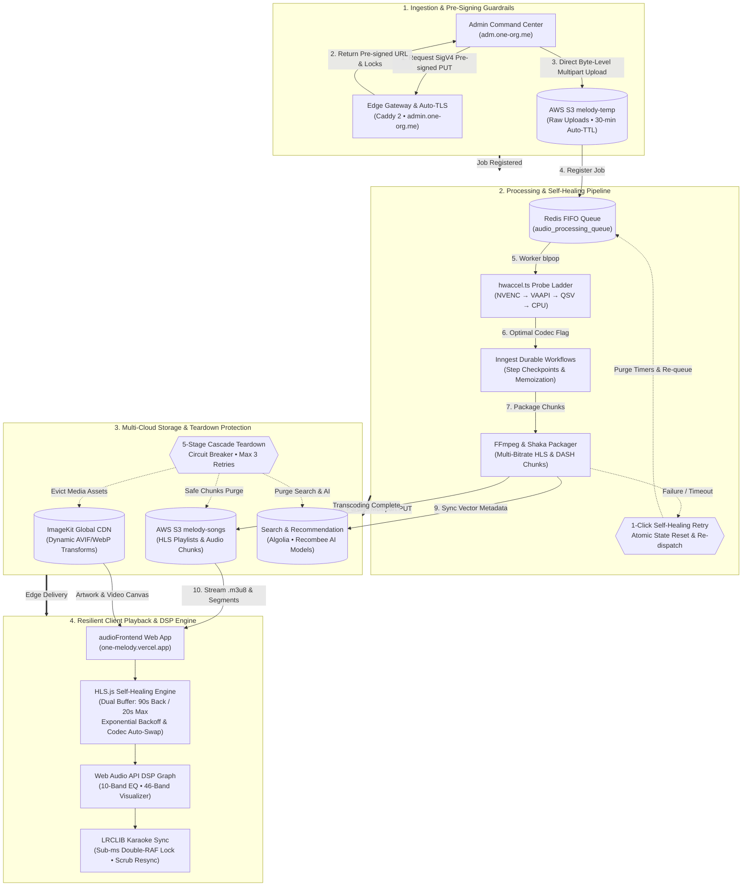
```mermaid
flowchart TD
    subgraph P1 ["1. Ingestion & Pre-Signing Guardrails"]
        direction TB
        UI["Admin Command Center<br/>(adm.one-org.me)"]
        AUTH["Edge Gateway & Auto-TLS<br/>(Caddy 2 &bull; admin.one-org.me)"]
        S3_TEMP[("AWS S3 melody-temp<br/>(Raw Uploads &bull; 30-min Auto-TTL)")]
        
        UI -->|"1. Request SigV4 Pre-signed PUT"| AUTH
        AUTH -->|"2. Return Pre-signed URL & Locks"| UI
        UI -->|"3. Direct Byte-Level Multipart Upload"| S3_TEMP
    end

    subgraph P2 ["2. Processing & Self-Healing Pipeline"]
        direction TB
        QUEUE[("Redis FIFO Queue<br/>(audio_processing_queue)")]
        PROBE["hwaccel.ts Probe Ladder<br/>(NVENC &rarr; VAAPI &rarr; QSV &rarr; CPU)"]
        INNGEST["Inngest Durable Workflows<br/>(Step Checkpoints & Memoization)"]
        SHAKA["FFmpeg & Shaka Packager<br/>(Multi-Bitrate HLS & DASH Chunks)"]
        RETRY_LOOP{{"1-Click Self-Healing Retry<br/>Atomic State Reset & Re-dispatch"}}

        S3_TEMP -->|"4. Register Job"| QUEUE
        QUEUE -->|"5. Worker blpop"| PROBE
        PROBE -->|"6. Optimal Codec Flag"| INNGEST
        INNGEST -->|"7. Package Chunks"| SHAKA
        SHAKA -.->|"Failure / Timeout"| RETRY_LOOP
        RETRY_LOOP -.->|"Purge Timers & Re-queue"| QUEUE
    end

    subgraph P3 ["3. Multi-Cloud Storage & Teardown Protection"]
        direction TB
        S3_PERM[("AWS S3 melody-songs<br/>(HLS Playlists & Audio Chunks)")]
        IMAGEKIT[("ImageKit Global CDN<br/>(Dynamic AVIF/WebP Transforms)")]
        SEARCH_AI[("Search & Recommendation<br/>(Algolia &bull; Recombee AI Models)")]
        TEARDOWN{{"5-Stage Cascade Teardown<br/>Circuit Breaker &bull; Max 3 Retries"}}

        SHAKA -->|"8. Parallel Multipart PUT"| S3_PERM
        SHAKA -->|"9. Sync Vector Metadata"| SEARCH_AI
        TEARDOWN -.->|"Safe Chunks Purge"| S3_PERM
        TEARDOWN -.->|"Evict Media Assets"| IMAGEKIT
        TEARDOWN -.->|"Purge Search & AI"| SEARCH_AI
    end

    subgraph P4 ["4. Resilient Client Playback & DSP Engine"]
        direction TB
        PLAYER["audioFrontend Web App<br/>(one-melody.vercel.app)"]
        HLS_ENGINE["HLS.js Self-Healing Engine<br/>(Dual Buffer: 90s Back / 20s Max<br/>Exponential Backoff & Codec Auto-Swap)"]
        DSP_GRAPH["Web Audio API DSP Graph<br/>(10-Band EQ &bull; 46-Band Visualizer)"]
        KARAOKE["LRCLIB Karaoke Sync<br/>(Sub-ms Double-RAF Lock &bull; Scrub Resync)"]

        S3_PERM -->|"10. Stream .m3u8 & Segments"| PLAYER
        IMAGEKIT -->|"Artwork & Video Canvas"| PLAYER
        PLAYER --> HLS_ENGINE
        HLS_ENGINE --> DSP_GRAPH
        DSP_GRAPH --> KARAOKE
    end

    P1 ==>|"Job Registered"| P2
    P2 ==>|"Transcoding Complete"| P3
    P3 ==>|"Edge Delivery"| P4
```

| Resilience Pillar | Technical Challenge | Platform Solution | Automated Self-Healing Mechanism |
| :--- | :--- | :--- | :--- |
| **Ingestion & Security** | Large raw media files exhausting backend API bandwidth and memory. | Direct client &rarr; S3 uploads via SigV4 pre-signed PUT URLs with strict content-type locking. | 30-minute S3 lifecycle auto-purge cleans abandoned temporary uploads with zero operator intervention. |
| **Media Processing** | Unpredictable GPU encoder crashes, worker OOMs, and network drops. | `hwaccel.ts` dynamic encoder probe ladder (NVENC &rarr; VAAPI &rarr; QSV &rarr; CPU) with Inngest step memoization. | **1-Click Self-Healing**: Atomic state reset purges stage timers and re-dispatches to Redis `audio_processing_queue`. |
| **Multi-Cloud Teardown** | Partial deletions leaving orphan files across S3, CDN, Algolia, and Postgres. | 5-stage transactional cascade state machine across Algolia, Recombee, ImageKit, S3, and database. | Max 3 retry threshold before trip-lock circuit breaker freezes job for manual audit, preventing cloud cascade storms. |
| **Client HLS Playback** | Transient packet loss, audio decoder stalls, and micro-buffer holes. | Mathematically tuned dual buffer window (90s back / 20s max) with micro-gap auto-jumping ($0.5\text{s}$ tolerance). | Exponential backoff reconnects ($2^n \times 500\text{ms}$), automatic codec swapping via `hls.swapAudioCodec()`. |
| **Karaoke Lyrics Sync** | Frame jitter and desynchronization when users scrub the playback bar. | Continuous double-`requestAnimationFrame` render loop with $O(\log n)$ binary search lookup. | Instant re-anchor upon $\Delta t > 1.5\text{s}$ seek jumps, smoothly releasing user scroll locks after 4 seconds of idle. |

---

### 🛡️ 1. Multi-Tier Retry Handling & Distributed Fault Tolerance

In distributed streaming platforms, component failures are constant: GPU encoders run out of memory on complex bitstreams, CDN origin shield limits return HTTP 429s, transient network splits disrupt S3 multipart uploads, and SMTP servers enforce rate throttles. One Melody rejects fragile "fail-and-forget" patterns in favor of a **four-tiered resilience and automated self-healing hierarchy**:


```mermaid
flowchart TD
    subgraph T1 ["Tier 1: Ingestion Pipeline Self-Healing"]
        A1["Job Fails in TRANSCODING / PACKAGING / UPLOADING"] --> A2["JobsEntity updated: status=FAILED, failedAt=NOW(), failureReason=Stack"]
        A2 --> A3["Admin triggers 1-Click Retry: POST /admin/jobs/{jobId}/retry"]
        A3 --> A4{"Is job.status == FAILED?"}
        A4 -->|No| A5["Throw IllegalStateException 400 Bad Request"]
        A4 -->|Yes| A6["Execute Atomic State Reset inside @Transactional:<br/>- status = PENDING, stage = QUEUED<br/>- failureReason = null, failedAt = null<br/>- Wipe startedAt, transcodeStartedAt, uploadStartedAt, etc.<br/>- Wipe downloadDurationMs, transcodeDurationMs, etc.<br/>- transcodingAttempt++"]
        A6 --> A7["Construct AudioProcessingQueueDto with song & temp metadata"]
        A7 --> A8["Push to Redis list: redisTemplate.opsForList().rightPush('audio_processing_queue')"]
        A8 --> A9["Worker daemon pops via blpop(5s) &rarr; Inngest resumes execution"]
    end

    subgraph T2 ["Tier 2: Cascade Teardown Durability & Circuit Breakers"]
        B1["Teardown failure during S3 / ImageKit / Algolia / Recombee purge"] --> B2["DeleteJobsEntity updated: status=FAILED, errorMessage=Exception"]
        B2 --> B3["Admin triggers Retry: POST /admin/delete-jobs/{jobId}/retry"]
        B3 --> B4{"attemptCount &lt; maxAttempts (3)?"}
        B4 -->|Yes| B5["attemptCount++ & status = PENDING<br/>Re-enqueue to Redis delete_event_queue"]
        B4 -->|No| B6["Circuit Breaker TRIPPED:<br/>Lock job permanently & require manual admin intervention<br/>Option to purge audit record via DELETE /admin/delete-jobs/{id}"]
    end

    subgraph T3 ["Tier 3: Transactional Mail Worker Protection"]
        C1["Redis mail_queue pop"] --> C2["Dispatch OTP / Verification Email via Google SMTP"]
        C2 -->|"EAUTH / 454 / 535 / Lockout"| C3["Authentication Circuit Breaker:<br/>1. Push job directly to mail_queue_dlq<br/>2. Sleep worker loop 30 seconds (await sleep(30000))<br/>3. Prevent SMTP ban and IP blacklisting"]
        C2 -->|"Network / Timeout / Socket Error"| C4["Calculate Truncated Exponential Backoff:<br/>delay = min(5000 * 2^(retries-1), 30000) ms"]
        C4 --> C5{"retries &lt; MAX_RETRIES (3)?"}
        C5 -->|Yes| C6["Increment retry counter & re-push to Redis mail_queue"]
        C5 -->|No| C7["Push to mail_queue_dlq with full error diagnostics & audit timestamp"]
    end

    subgraph T4 ["Tier 4: Client-Side HLS Playback Self-Healing"]
        D1["HLS.js emits ERROR event"] --> D2{"data.fatal == true?"}
        D2 -->|No| D3["Filter non-fatal warnings (e.g. fragParsingError)<br/>Let internal demuxer auto-recover"]
        D2 -->|Yes| D4{"Classify Error Type"}
        D4 -->|NETWORK_ERROR| D5["Exponential Backoff Retry:<br/>delay = 2^attempt * 500 ms (max 3 attempts)<br/>Clear active timer & trigger hls.startLoad()"]
        D5 -->|"Retries Exceeded"| D6["Trigger Interactive Sonner Toast with 1-Click 'Retry Stream'"]
        D4 -->|MEDIA_ERROR| D7{"mediaRetryCount &le; 1?"}
        D7 -->|Yes| D8["Call hls.recoverMediaError()"]
        D7 -->|No| D9["Persistent Glitch: Call hls.swapAudioCodec()<br/>Followed by hls.recoverMediaError() to switch decoder pipelines"]
    end
```

#### Atomic State Reset Mechanics ([`JobRetryView`](file:///Users/Karan/Desktop/Coding/AudioMelodySpringboot/admin/admin/api/views.py#L1540-L1569) & [`JobMonitoringService.java`](file:///Users/Karan/Desktop/Coding/AudioMelodySpringboot/coreEngine/src/main/java/me/one_org/melody/Services/Admin/JobMonitoringService.java))
When an administrator triggers a retry from the modern admin panel (`POST /admin/jobs/{jobId}/retry`), the administrative backend executes an atomic reset within an isolated database transaction to guarantee zero race conditions. In the Python 3.12 / Django 6.1 administrative microservice:

```python
class JobRetryView(BaseAdminView):
    def post(self, request, pk):
        job = get_object_or_404(Job, pk=pk)
        old_status = job.status

        # 1. Reset high-level status & stage
        job.status = "PENDING"
        job.current_stage = "QUEUED"
        job.failure_reason = None
        job.failed_at = None

        # 2. Wipe previous stage execution timers and durations
        job.completed_at = None
        job.transcoding_started_at = None
        job.transcoded_at = None
        job.recommendation_saved_at = None
        job.search_saved_at = None
        job.transcoding_duration_ms = None
        job.recommendation_duration_ms = None
        job.search_duration_ms = None
        job.finalize_duration_ms = None
        job.total_duration_ms = None
        job.transcoded = False
        job.saved_in_search = False
        job.saved_in_recommendation = False

        # 3. Increment retry telemetry counter
        job.transcoding_attempt = (job.transcoding_attempt or 0) + 1
        job.save()

        # 4. Invalidate pagination metadata cache & dispatch to Redis FIFO queue
        PaginationMetadataService.transition_job(old_status, "PENDING")
        RedisService.queue_audio_processing(job.id)

        return Response(to_job_progress_dto(job), status=status.HTTP_200_OK)
```

The corresponding Java / Spring Boot transaction follows identical state invariance:

```java
@Transactional
public void retryJob(UUID jobId) {
    JobsEntity job = jobsRepository.findById(jobId)
        .orElseThrow(() -> new EntityNotFoundException("Job not found: " + jobId));

    if (job.getStatus() != JobStatus.FAILED) {
        throw new IllegalStateException("Only FAILED jobs can be retried. Current status: " + job.getStatus());
    }

    // 1. Reset high-level state
    job.setStatus(JobStatus.PENDING);
    job.setStage(JobStage.QUEUED);
    job.setFailureReason(null);
    job.setFailedAt(null);

    // 2. Wipe previous stage execution timers and durations
    job.setStartedAt(null);
    job.setDownloadStartedAt(null);
    job.setDownloadCompletedAt(null);
    job.setTranscodeStartedAt(null);
    job.setTranscodeCompletedAt(null);
    job.setPackagingStartedAt(null);
    job.setPackagingCompletedAt(null);
    job.setUploadStartedAt(null);
    job.setUploadCompletedAt(null);
    job.setCompletedAt(null);
    job.setDownloadDurationMs(null);
    job.setTranscodeDurationMs(null);
    job.setPackagingDurationMs(null);
    job.setUploadDurationMs(null);
    job.setTotalDurationMs(null);

    // 3. Increment retry telemetry counter
    int attempts = job.getTranscodingAttempt() == null ? 0 : job.getTranscodingAttempt();
    job.setTranscodingAttempt(attempts + 1);
    jobsRepository.save(job);

    // 4. Atomically dispatch to Redis audio processing FIFO queue
    AudioProcessingQueueDto payload = AudioProcessingQueueDto.builder()
        .jobId(job.getId())
        .songId(job.getSong().getId())
        .tempS3Key(job.getTempS3Key())
        .contentType(job.getContentType())
        .transcodingAttempt(job.getTranscodingAttempt())
        .build();
    redisTemplate.opsForList().rightPush("audio_processing_queue", payload);
}
```

#### Fault Tolerance & Recovery Matrix

| Component Layer | Failure Scenario | Detection Vector | Automated Mitigation | Operator Fallback |
| :--- | :--- | :--- | :--- | :--- |
| **Media Transcoder** | GPU OOM / CUDA Driver Crash | Non-zero exit code on FFmpeg child process | [hwaccel.ts](file:///Users/Karan/Desktop/Coding/AudioMelodySpringboot/audioProcessing/lib/transcode/hwaccel.ts) software fallback wrapper re-executes with `libx264 -preset veryfast` | 1-Click Retry button in Admin UI (`POST /admin/jobs/{id}/retry`) |
| **Cascade Teardown** | AWS S3 503 / ImageKit API 429 | Caught exception during multi-cloud step | Retry up to 3 times with exponential spacing | Circuit breaker trips; manual audit or record purge via `DELETE /admin/delete-jobs/{id}` |
| **Transactional Mail** | Google SMTP EAUTH / 535 Lockout | Nodemailer error code inspection | Push to `mail_queue_dlq` and halt worker loop for 30s to avert Google IP blacklist | Inspect Dead-Letter Queue via Redis CLI and re-verify App Password |
| **HLS Stream Client** | Fragment fetch timeout / CDN drop | `Hls.Events.ERROR` (`NETWORK_ERROR`) | Exponential backoff $2^n \times 500\text{ms}$ up to 3 tries via `hls.startLoad()` | Interactive Sonner toast with manual "Retry Stream" action |
| **Audio Decoder** | Corrupted AAC timestamp / frame discontinuity | `Hls.Events.ERROR` (`MEDIA_ERROR`) | Step 1: `hls.recoverMediaError()`; Step 2: `hls.swapAudioCodec()` | User timeline scrub forces clean buffer flush and source re-attach |

---

### ⚡ 2. Hardware Acceleration Auto-Probing & Adaptive Buffer Analysis

#### Transcoding Hardware Auto-Probing Engine ([hwaccel.ts](file:///Users/Karan/Desktop/Coding/AudioMelodySpringboot/audioProcessing/lib/transcode/hwaccel.ts))

Multimedia processing workloads vary drastically depending on host infrastructure: local Apple Silicon workstations, cloud GPU instances (NVIDIA Tesla T4/A10G), Intel Xeon servers with Quick Sync (QSV), AMD EPYC servers with AMF, or bare-metal Linux ARM SBCs. Hardcoding encoder flags leads to immediate startup crashes.

One Melody solves this via **live 1-frame dummy encoding probes against FFmpeg's `null` muxer** executed during worker initialization with a strict **3.5-second hard timeout**:

```typescript
// Live 1-frame probe test: encodes a 64x64 dummy black frame into /dev/null
await execFileAsync("ffmpeg", [
    "-nostdin",
    "-y",
    "-v", "error",
    "-f", "lavfi",
    "-i", "color=c=black:s=64x64:d=0.04",
    "-c:v", candidateEncoder,
    ...extraProbeArgs,
    "-frames:v", "1",
    "-f", "null",
    "-"
], { timeout: 3500 });
```

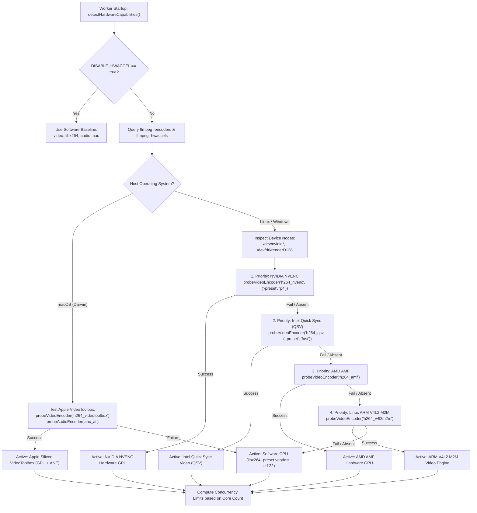
```mermaid
flowchart TD
    Start["Worker Startup: detectHardwareCapabilities()"] --> EnvCheck{"DISABLE_HWACCEL == true?"}
    EnvCheck -->|Yes| ForceSW["Use Software Baseline:<br/>video: libx264, audio: aac"]
    EnvCheck -->|No| ProbeEncoders["Query ffmpeg -encoders & ffmpeg -hwaccels"]
    
    ProbeEncoders --> PlatformCheck{"Host Operating System?"}
    
    PlatformCheck -->|"macOS (Darwin)"| AppleProbe["Test Apple VideoToolbox:<br/>probeVideoEncoder('h264_videotoolbox')<br/>probeAudioEncoder('aac_at')"]
    AppleProbe -->|Success| SetApple["Active: Apple Silicon VideoToolbox (GPU + ANE)"]
    AppleProbe -->|Failure| CPUFall["Active: Software CPU (libx264 -preset veryfast -crf 22)"]
    
    PlatformCheck -->|"Linux / Windows"| GPUInspect["Inspect Device Nodes:<br/>/dev/nvidia*, /dev/dri/renderD128"]
    GPUInspect --> NVENC["1. Priority: NVIDIA NVENC<br/>probeVideoEncoder('h264_nvenc', ('-preset', 'p4'))"]
    NVENC -->|Success| SetNVENC["Active: NVIDIA NVENC Hardware GPU"]
    NVENC -->|"Fail / Absent"| QSV["2. Priority: Intel Quick Sync (QSV)<br/>probeVideoEncoder('h264_qsv', ('-preset', 'fast'))"]
    QSV -->|Success| SetQSV["Active: Intel Quick Sync Video (QSV)"]
    QSV -->|"Fail / Absent"| AMF["3. Priority: AMD AMF<br/>probeVideoEncoder('h264_amf')"]
    AMF -->|Success| SetAMF["Active: AMD AMF Hardware GPU"]
    AMF -->|"Fail / Absent"| V4L2["4. Priority: Linux ARM V4L2 M2M<br/>probeVideoEncoder('h264_v4l2m2m')"]
    V4L2 -->|Success| SetV4L2["Active: ARM V4L2 M2M Video Engine"]
    V4L2 -->|"Fail / Absent"| CPUFall
    
    SetApple --> Concurrency["Compute Concurrency Limits based on Core Count"]
    SetNVENC --> Concurrency
    SetQSV --> Concurrency
    SetAMF --> Concurrency
    SetV4L2 --> Concurrency
    CPUFall --> Concurrency
```

#### Dynamic Concurrency Tuning Formulas
To prevent container OOM-kills and CPU starvation on multi-tenant cloud virtual machines, concurrency is dynamically modulated:

$$\text{Max Video Concurrency} = \begin{cases} \max(2, \min(4, \lfloor N_{\text{cores}} / 2 \rfloor)) & \text{if GPU Hardware Accelerated} \\ \max(1, \min(3, \lfloor N_{\text{cores}} / 2 \rfloor)) & \text{if Software CPU (libx264)} \end{cases}$$

$$\text{Max Audio Concurrency} = \max(2, \min(6, N_{\text{cores}}))$$

#### Client Playback Buffer Controller ([useHlsPlayer.ts](file:///Users/Karan/Desktop/Coding/AudioMelodySpringboot/audioFrontend/src/components/player/hooks/useHlsPlayer.ts))

The frontend HLS player enforces a dual-buffer window strategy that delivers instant backwards scrubbing while minimizing cellular data consumption:

| Configuration Parameter | Value | Engineering Rationale |
| :--- | :--- | :--- |
| `backBufferLength` | `90s` | Retains up to 90 seconds of previously decoded audio chunks in memory. Enables zero-latency, instant backwards seeking without issuing new HTTP segment GET requests to the CDN. |
| `maxBufferLength` | `20s` | Constrains forward buffering to 20 seconds. Prevents mobile device memory exhaustion and stops users from consuming megabytes of cellular data if they skip tracks after 10 seconds. |
| `maxMaxBufferLength` | `20s` | Hard ceiling for forward buffer expansion under high-bandwidth Wi-Fi conditions. |
| `manifestLoadingTimeOut` | `15,000ms` | Network timeout for master playlist fetching before triggering exponential backoff. |
| `manifestLoadingMaxRetry`| `3` | Maximum automatic retries for manifest loading before notifying the user interface. |
| `fragLoadingTimeOut` | `20,000ms` | Network timeout for individual audio/video chunk (`.ts` / `.m4s`) fetches. |
| `fragLoadingMaxRetry` | `4` | Segment retrieval retry limit with internal jitter before surfacing fatal errors. |

#### Buffer Hole Auto-Jumping & Telemetry ([PlayerStreamHealthBadge.tsx](file:///Users/Karan/Desktop/Coding/AudioMelodySpringboot/audioFrontend/src/components/player/PlayerStreamHealthBadge.tsx))
- **Hole Jumping**: HLS.js is configured to automatically detect micro-gaps ($< 0.5\text{s}$) between media segments caused by CDN packet loss or clock drift, nudging the playback head past the hole without triggering playback stall interruptions.
- **Stream Health Telemetry**: Computes ahead buffer health in real time:
  $$\text{Buffered Ahead} = \max\left(0, \left\lfloor \text{Time}_{\text{bufferedEnd}} - \text{Time}_{\text{current}} \right\rfloor\right)\text{ seconds}$$
  - **`EXCELLENT`** ($\ge 15\text{s}$): Emerald indicator. Full buffer window saturated, impervious to network jitter.
  - **`MODERATE`** ($5\text{s} \le t < 15\text{s}$): Amber indicator. Stable streaming under moderate network conditions.
  - **`CRITICAL`** ($< 5\text{s}$): Red pulsating indicator. Approaching buffer starvation.
  - **`BUFFERING`** (`isLoading == true`): Amber spinner. Pipeline awaiting initial chunk demuxing.

---

### ☁️ 3. AWS S3 Multi-Bucket Architecture, Global CDN & Zero-Trust HTTPS

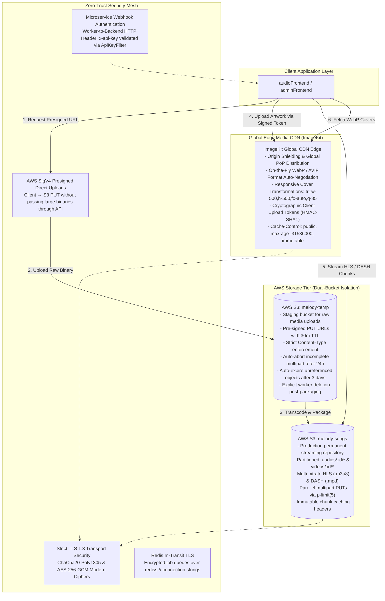
```mermaid
flowchart TB
    subgraph CAL ["Client Application Layer"]
        AF_U["audioFrontend / adminFrontend"]
    end

    subgraph AST ["AWS Storage Tier (Dual-Bucket Isolation)"]
        direction TB
        B_TEMP[("AWS S3: melody-temp<br/>- Staging bucket for raw media uploads<br/>- Pre-signed PUT URLs with 30m TTL<br/>- Strict Content-Type enforcement<br/>- Auto-abort incomplete multipart after 24h<br/>- Auto-expire unreferenced objects after 3 days<br/>- Explicit worker deletion post-packaging")]
        B_PROD[("AWS S3: melody-songs<br/>- Production permanent streaming repository<br/>- Partitioned: audios/:id/* & videos/:id/*<br/>- Multi-bitrate HLS (.m3u8) & DASH (.mpd)<br/>- Parallel multipart PUTs via p-limit(5)<br/>- Immutable chunk caching headers")]
    end

    subgraph GEMC ["Global Edge Media CDN (ImageKit)"]
        IK_EDGE["ImageKit Global CDN Edge<br/>- Origin Shielding & Global PoP Distribution<br/>- On-the-Fly WebP / AVIF Format Auto-Negotiation<br/>- Responsive Cover Transformations: tr=w-500,h-500,fo-auto,q-85<br/>- Cryptographic Client Upload Tokens (HMAC-SHA1)<br/>- Cache-Control: public, max-age=31536000, immutable"]
    end

    subgraph ZTSM ["Zero-Trust Security Mesh"]
        SEC_TLS["Strict TLS 1.3 Transport Security<br/>ChaCha20-Poly1305 & AES-256-GCM Modern Ciphers"]
        SEC_SIG["AWS SigV4 Presigned Direct Uploads<br/>Client &rarr; S3 PUT without passing large binaries through API"]
        SEC_KEY["Microservice Webhook Authentication<br/>Worker-to-Backend HTTP Header: x-api-key validated via ApiKeyFilter"]
        SEC_RED["Redis In-Transit TLS<br/>Encrypted job queues over rediss:// connection strings"]
    end

    AF_U -->|"1. Request Presigned URL"| SEC_SIG
    SEC_SIG -->|"2. Upload Raw Binary"| B_TEMP
    B_TEMP -->|"3. Transcode & Package"| B_PROD
    AF_U -->|"4. Upload Artwork via Signed Token"| IK_EDGE
    AF_U -->|"5. Stream HLS / DASH Chunks"| B_PROD
    AF_U -->|"6. Fetch WebP Covers"| IK_EDGE
    B_PROD -.-> SEC_TLS
    IK_EDGE -.-> SEC_TLS
    SEC_KEY -.-> AF_U
```

#### Dual-Bucket Storage Partitioning Specifications

```
AWS S3 Multi-Bucket Architecture
├── 🪣 melody-temp (Ingestion Staging)
│   ├── raw_audio_{jobId}.mp3              # Direct client uploads via SigV4 PUT
│   ├── raw_video_main_{jobId}.mp4         # High-resolution master video
│   └── raw_video_canvas_{jobId}.mp4       # Raw portrait video canvas
│
└── 🪣 melody-songs (Permanent Multi-Bitrate Streaming)
    ├── audios/{songId}/
    │   ├── master.m3u8                    # Master HLS adaptive playlist
    │   ├── stream.mpd                     # MPEG-DASH manifest
    │   ├── audio_128k.m3u8 + segments/    # Low-bandwidth mobile profile (128 kbps)
    │   ├── audio_192k.m3u8 + segments/    # Standard mobile profile (192 kbps)
    │   ├── audio_256k.m3u8 + segments/    # High-fidelity desktop profile (256 kbps)
    │   └── audio_320k.m3u8 + segments/    # Master studio profile (320 kbps)
    ├── videos/{songId}/
    │   ├── master.m3u8                    # Master adaptive video playlist
    │   ├── video_1080p.m3u8 + segments/   # Full HD 1080p @ 4500 kbps
    │   ├── video_720p.m3u8 + segments/    # HD 720p @ 2500 kbps
    │   ├── video_480p.m3u8 + segments/    # SD 480p @ 1200 kbps
    │   └── video_360p.m3u8 + segments/    # Mobile 360p @ 600 kbps
    └── canvas/{songId}/
        └── canvas.mp4                     # 9:16 vertical looping clip (1080x1920)
```

#### Parallel S3 Multipart Upload Pipeline
Rather than buffering entire transcode outputs into worker RAM, the engine streams files directly from high-speed local NVMe scratch storage (`/tmp/transcoded_*`) to S3 using a bounded concurrency pool governed by `p-limit(5)`:
- Limits concurrent S3 socket connections to 5, preventing TCP buffer bloat.
- Applies SHA-256 checksum validation on each uploaded chunk.
- Tags manifests with `Cache-Control: no-cache, no-store` and media segments with `Cache-Control: public, max-age=31536000, immutable`.

---

### 🔄 4. Inngest Durable Execution Workflows

Standard job queues (such as basic Redis workers or BullMQ) suffer from a critical flaw: if a worker instance restarts or an uncaught exception occurs mid-way through a 7-stage media pipeline, all completed work is lost, forcing the entire pipeline to re-run from scratch.

One Melody eliminates this via **Inngest Durable Step Execution**, providing **step-level checkpointing, deterministic replay, and state memoization**:

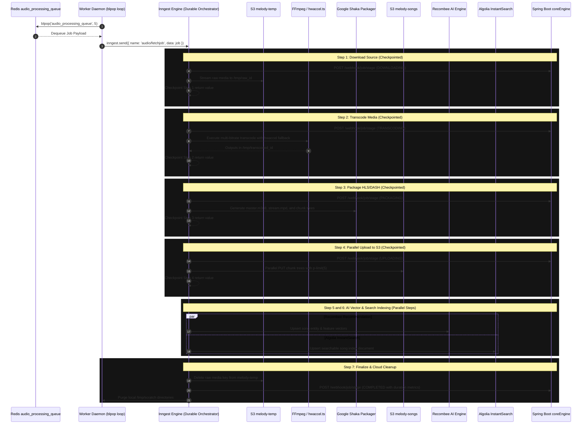
```mermaid
sequenceDiagram
    autonumber
    participant Redis as Redis audio_processing_queue
    participant Worker as Worker Daemon (blpop loop)
    participant Inngest as Inngest Engine (Durable Orchestrator)
    participant S3Temp as S3 melody-temp
    participant FFmpeg as FFmpeg / hwaccel.ts
    participant Shaka as Google Shaka Packager
    participant S3Prod as S3 melody-songs
    participant Recombee as Recombee AI Engine
    participant Algolia as Algolia InstantSearch
    participant Spring as Spring Boot coreEngine

    Worker->>Redis: blpop('audio_processing_queue', 5)
    Redis-->>Worker: Dequeue Job Payload
    Worker->>Inngest: inngest.send({ name: 'audio/fetchjob', data: job })

    rect rgb(20, 20, 20)
        Note over Inngest,Spring: Step 1: Download Source (Checkpointed)
        Inngest->>Spring: POST /webhook/job/stage (DOWNLOADING)
        Inngest->>S3Temp: Stream raw media to /tmp/raw_id
        Inngest-->>Inngest: Checkpoint Step 1 return value
    end

    rect rgb(20, 20, 20)
        Note over Inngest,Spring: Step 2: Transcode Media (Checkpointed)
        Inngest->>Spring: POST /webhook/job/stage (TRANSCODING)
        Inngest->>FFmpeg: Execute multi-bitrate transcode with hwaccel fallback
        FFmpeg-->>Inngest: Outputs in /tmp/transcoded_id
        Inngest-->>Inngest: Checkpoint Step 2 return value
    end

    rect rgb(20, 20, 20)
        Note over Inngest,Spring: Step 3: Package HLS/DASH (Checkpointed)
        Inngest->>Spring: POST /webhook/job/stage (PACKAGING)
        Inngest->>Shaka: Generate master.m3u8, stream.mpd, and chunk trees
        Inngest-->>Inngest: Checkpoint Step 3 return value
    end

    rect rgb(20, 20, 20)
        Note over Inngest,Spring: Step 4: Parallel Upload to S3 (Checkpointed)
        Inngest->>Spring: POST /webhook/job/stage (UPLOADING)
        Inngest->>S3Prod: Parallel PUT chunk trees with p-limit(5)
        Inngest-->>Inngest: Checkpoint Step 4 return value
    end

    rect rgb(20, 20, 20)
        Note over Inngest,Spring: Step 5 and 6: AI Vector & Search Indexing (Parallel Steps)
        par Recombee Recommendation
            Inngest->>Recombee: Upsert song entity & feature vectors
        and Algolia InstantSearch
            Inngest->>Algolia: Upsert searchable song index document
        end
    end

    rect rgb(20, 20, 20)
        Note over Inngest,Spring: Step 7: Finalize & Cloud Cleanup
        Inngest->>S3Temp: Delete raw media key from melody-temp
        Inngest->>Spring: POST /webhook/job/stage (COMPLETED with duration metrics)
        Inngest->>Worker: Purge local /tmp/scratch directories
    end
```

#### Why Durable Execution Protects Cloud Infrastructure
- **Spot Instance Resiliency**: If a worker VM running on AWS Spot Instances is reclaimed during Step 4 (`upload-s3`), the job is rescheduled on a new VM. Inngest detects that Steps 1–3 are already checkpointed in its durable event log, skips re-downloading and re-encoding, and immediately resumes at Step 4.
- **Granular Webhook Telemetry**: Each milestone sends an authenticated callback to Spring Boot (`/webhook/job/...`), carrying millisecond-level duration measurements (`downloadDurationMs`, `transcodeDurationMs`, `packagingDurationMs`, `uploadDurationMs`) that render live in the admin Gantt dashboard.

---

### 🎤 5. High-Precision Karaoke Lyrics Synchronization (LRCLIB)

Delivering a fluid karaoke experience requires orchestrating network retrieval, time quantization, $\mathcal{O}(\log n)$ binary search lookup, micro-batch DOM rendering, and user scroll detection:

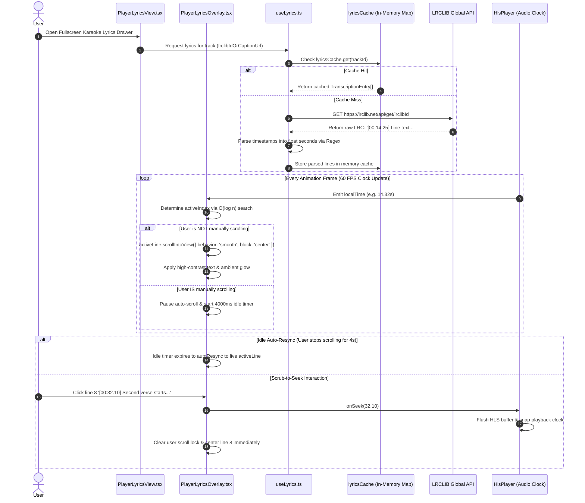
```mermaid
sequenceDiagram
    autonumber
    actor User
    participant View as PlayerLyricsView.tsx
    participant Overlay as PlayerLyricsOverlay.tsx
    participant Hook as useLyrics.ts
    participant Cache as lyricsCache (In-Memory Map)
    participant LRCLIB as LRCLIB Global API
    participant Player as HlsPlayer (Audio Clock)

    User->>View: Open Fullscreen Karaoke Lyrics Drawer
    View->>Hook: Request lyrics for track (lrclibIdOrCaptionUrl)
    Hook->>Cache: Check lyricsCache.get(trackId)
    alt Cache Hit
        Cache-->>Hook: Return cached TranscriptionEntry[]
    else Cache Miss
        Hook->>LRCLIB: GET https://lrclib.net/api/get/lrclibId
        LRCLIB-->>Hook: Return raw LRC: '[00:14.25] Line text...'
        Hook->>Hook: Parse timestamps into float seconds via Regex
        Hook->>Cache: Store parsed lines in memory cache
    end

    loop Every Animation Frame (60 FPS Clock Update)
        Player->>Overlay: Emit localTime (e.g. 14.32s)
        Overlay->>Overlay: Determine activeIndex via O(log n) search
        alt User is NOT manually scrolling
            Overlay->>Overlay: activeLine.scrollIntoView({ behavior: 'smooth', block: 'center' })
            Overlay->>Overlay: Apply high-contrast text & ambient glow
        else User IS manually scrolling
            Overlay->>Overlay: Pause auto-scroll & start 4000ms idle timer
        end
    end

    alt Idle Auto-Resync (User stops scrolling for 4s)
        Overlay->>Overlay: Idle timer expires to autoResync to live activeLine
    else Scrub-to-Seek Interaction
        User->>Overlay: Click line 8 '[00:32.10] Second verse starts...'
        Overlay->>Player: onSeek(32.10)
        Player->>Player: Flush HLS buffer & snap playback clock
        Overlay->>Overlay: Clear user scroll lock & center line 8 immediately
    end
```

#### LRC Regex Parsing & Time Quantization ([useLyrics.ts](file:///Users/Karan/Desktop/Coding/AudioMelodySpringboot/audioFrontend/src/components/player/hooks/useLyrics.ts))
Standard and high-precision LRC timestamps (`[mm:ss.xx]` and `[mm:ss.xxx]`) are parsed and converted to floating-point seconds:

```typescript
export function parseLrcToTranscriptions(lrcText: string): TranscriptionEntry[] {
    if (!lrcText) return [];
    const lines = lrcText.split("\n");
    const parsed: { time: number; text: string }[] = [];

    for (const line of lines) {
        const match = line.match(/\[(\d+):(\d+(?:\.\d+)?)\](.*)/);
        if (match) {
            const minutes = parseFloat(match[1]);
            const seconds = parseFloat(match[2]);
            const text = match[3].trim();
            const time = minutes * 60 + seconds;
            if (text) parsed.push({ time, text });
        }
    }

    parsed.sort((a, b) => a.time - b.time);

    return parsed.map((item, idx) => ({
        transcript: item.text,
        start_time_seconds: item.time,
        end_time_seconds: idx < parsed.length - 1 ? parsed[idx + 1].time : item.time + 5,
        words: [],
    }));
}
```

#### High-Precision Active Line Lookup & Auto-Scroll Mechanics ([PlayerLyricsOverlay.tsx](file:///Users/Karan/Desktop/Coding/AudioMelodySpringboot/audioFrontend/src/components/player/PlayerLyricsOverlay.tsx))
1. **Sub-Millisecond Active Line Determination**:
   $$\text{Active Line Index } i \iff t_{\text{local}} \ge \text{lines}[i].\text{start} \land \left(\text{lines}[i+1] == \varnothing \lor t_{\text{local}} < \text{lines}[i+1].\text{start}\right)$$
2. **Double-RAF Render Lock**:
   When loading lyrics or switching languages, a single `requestAnimationFrame` can fire before React finishes committing DOM node refs. A nested double-RAF pattern guarantees that `activeLineRef` is mounted before measuring container bounds:
   ```typescript
   const raf1 = requestAnimationFrame(() => {
       raf2 = requestAnimationFrame(() => {
           scrollToActiveLine(false);
       });
   });
   ```
3. **4-Second Idle Auto-Resync**: If the user manually scrolls (`onWheel`, `onTouchMove`), auto-scrolling is immediately paused (`isUserScrolledRef.current = true`). An idle timer resets on every touch; after **4,000ms of inactivity**, the view automatically smooth-scrolls back to the singing line!
4. **1.5-Second Seek-Jump Detection**: If playback jumps by $> 1.5\text{s}$ (the user dragged the progress bar or clicked a timeline chapter), manual scroll locks are wiped instantly, snapping the lyrics viewer to the new position.
5. **Interactive Scrub-to-Seek**: Clicking any lyric line calls `onSeek(line.start_time_seconds)`, which flushes the HLS playback buffer, repositions the audio playhead, resets user scroll locks, and smoothly centers the target lyric line.
6. **Live 46-Band Visualizer Fallback**: If a track lacks timed lyrics, the interface dynamically renders a live 46-band stereo frequency spectrum on an HTML5 canvas via the Web Audio API's `AnalyserNode`, blending into the album art's dominant color palette.

---

## 📑 Table of Contents

- [🌟 Executive Technical Highlights & Resilience Showcase](#-executive-technical-highlights--resilience-showcase)
  - [🛡️ 1. Multi-Tier Retry Handling & Distributed Fault Tolerance](#️-1-multi-tier-retry-handling--distributed-fault-tolerance)
  - [⚡ 2. Hardware Acceleration & Adaptive Buffer Analysis](#-2-hardware-acceleration--adaptive-buffer-analysis)
  - [☁️ 3. AWS S3 Multi-Bucket Architecture, Global CDN & Zero-Trust HTTPS](#️-3-aws-s3-multi-bucket-architecture-global-cdn--zero-trust-https)
  - [🔄 4. Inngest Durable Execution Workflows](#-4-inngest-durable-execution-workflows)
  - [🎤 5. High-Precision Karaoke Lyrics Synchronization (LRCLIB)](#-5-high-precision-karaoke-lyrics-synchronization-lrclib)
1. [System Architecture & Distributed Topology](#1-system-architecture--distributed-topology)
2. [Detailed Architectural Decisions & Engineering Rationale](#2-detailed-architectural-decisions--engineering-rationale)
3. [Media Packaging & Hardware Acceleration Pipeline](#3-media-packaging--hardware-acceleration-pipeline)
4. [5-Stage Zero-Orphan Cascade Deletion Teardown](#4-5-stage-zero-orphan-cascade-deletion-teardown)
5. [Hi-Fi Web Audio API & DSP Sound Architecture](#5-hi-fi-web-audio-api--dsp-sound-architecture)
6. [Real-Time Byte-Level Upload Tracking Engine](#6-real-time-byte-level-upload-tracking-engine)
7. [Database Schema & Entity Relational Model (ERD)](#7-database-schema--entity-relational-model-erd)
8. [Dual-Pipeline State Machines & Self-Healing Retries](#8-dual-pipeline-state-machines--self-healing-retries)
9. [Recombee AI Interaction & Recommendation Scoring Model](#9-recombee-ai-interaction--recommendation-scoring-model)
10. [Dual-Layer Security & Authentication Architecture](#10-dual-layer-security--authentication-architecture)
11. [Repository Catalog & File Tree](#11-repository-catalog--file-tree)
12. [API Reference & Webhook Contracts](#12-api-reference--webhook-contracts)
13. [Installation, Local Development & Docker Runbook](#13-installation-local-development--docker-runbook)

---

## 1. System Architecture & Distributed Topology

One Melody decouples public streaming APIs, administrative fleet orchestration, CPU/GPU media packaging, and transactional messaging into dedicated services routed via **Caddy 2** reverse proxy with automated Let's Encrypt TLS:

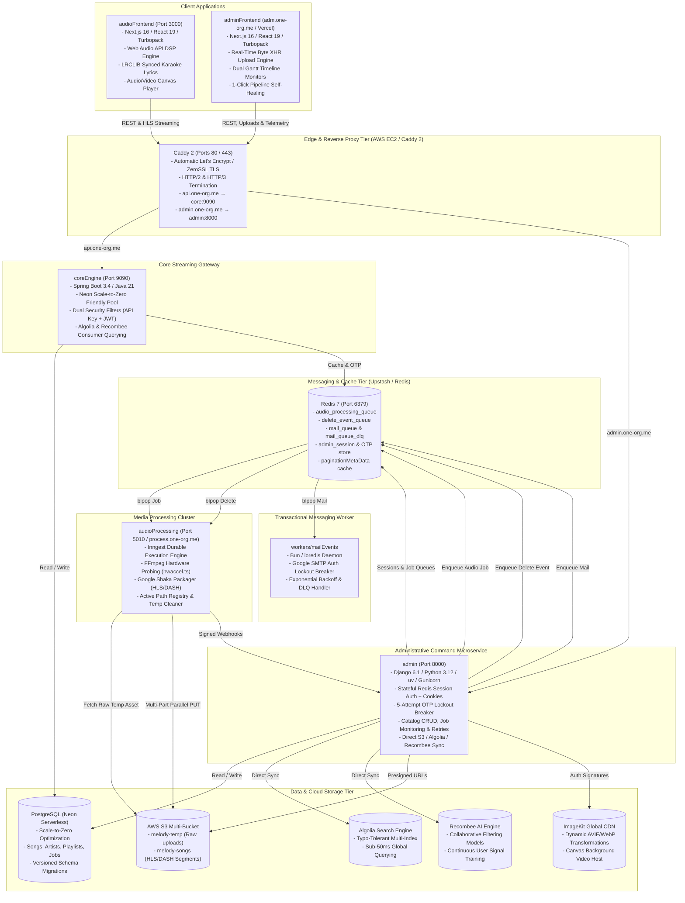
```mermaid
flowchart TB
    subgraph ET ["Edge & Reverse Proxy Tier (AWS EC2 / Caddy 2)"]
        CAD["Caddy 2 (Ports 80 / 443)<br/>- Automatic Let's Encrypt / ZeroSSL TLS<br/>- HTTP/2 & HTTP/3 Termination<br/>- api.one-org.me &rarr; core:9090<br/>- admin.one-org.me &rarr; admin:8000"]
    end

    subgraph CT ["Client Applications"]
        AF["audioFrontend (Port 3000)<br/>- Next.js 16 / React 19 / Turbopack<br/>- Web Audio API DSP Engine<br/>- LRCLIB Synced Karaoke Lyrics<br/>- Audio/Video Canvas Player"]
        ADF["adminFrontend (adm.one-org.me / Vercel)<br/>- Next.js 16 / React 19 / Turbopack<br/>- Real-Time Byte XHR Upload Engine<br/>- Dual Gantt Timeline Monitors<br/>- 1-Click Pipeline Self-Healing"]
    end

    subgraph COT ["Core Streaming Gateway"]
        CE["coreEngine (Port 9090)<br/>- Spring Boot 3.4 / Java 21<br/>- Neon Scale-to-Zero Friendly Pool<br/>- Dual Security Filters (API Key + JWT)<br/>- Algolia & Recombee Consumer Querying"]
    end

    subgraph AOT ["Administrative Command Microservice"]
        ADM["admin (Port 8000)<br/>- Django 6.1 / Python 3.12 / uv / Gunicorn<br/>- Stateful Redis Session Auth + Cookies<br/>- 5-Attempt OTP Lockout Breaker<br/>- Catalog CRUD, Job Monitoring & Retries<br/>- Direct S3 / Algolia / Recombee Sync"]
    end

    subgraph MCT ["Messaging & Cache Tier (Upstash / Redis)"]
        RD[("Redis 7 (Port 6379)<br/>- audio_processing_queue<br/>- delete_event_queue<br/>- mail_queue & mail_queue_dlq<br/>- admin_session & OTP store<br/>- paginationMetaData cache")]
    end

    subgraph MPC ["Media Processing Cluster"]
        AP["audioProcessing (Port 5010 / process.one-org.me)<br/>- Inngest Durable Execution Engine<br/>- FFmpeg Hardware Probing (hwaccel.ts)<br/>- Google Shaka Packager (HLS/DASH)<br/>- Active Path Registry & Temp Cleaner"]
    end

    subgraph TMW ["Transactional Messaging Worker"]
        MW["workers/mailEvents<br/>- Bun / ioredis Daemon<br/>- Google SMTP Auth Lockout Breaker<br/>- Exponential Backoff & DLQ Handler"]
    end

    subgraph DST ["Data & Cloud Storage Tier"]
        PG[("PostgreSQL (Neon Serverless)<br/>- Scale-to-Zero Optimization<br/>- Songs, Artists, Playlists, Jobs<br/>- Versioned Schema Migrations")]
        S3[("AWS S3 Multi-Bucket<br/>- melody-temp (Raw uploads)<br/>- melody-songs (HLS/DASH Segments)")]
        IK[("ImageKit Global CDN<br/>- Dynamic AVIF/WebP Transformations<br/>- Canvas Background Video Host")]
        AL[("Algolia Search Engine<br/>- Typo-Tolerant Multi-Index<br/>- Sub-50ms Global Querying")]
        RC[("Recombee AI Engine<br/>- Collaborative Filtering Models<br/>- Continuous User Signal Training")]
    end

    AF -->|"REST & HLS Streaming"| CAD
    ADF -->|"REST, Uploads & Telemetry"| CAD
    CAD -->|"api.one-org.me"| CE
    CAD -->|"admin.one-org.me"| ADM

    CE -->|"Read / Write"| PG
    CE -->|"Cache & OTP"| RD

    ADM -->|"Read / Write"| PG
    ADM -->|"Sessions & Job Queues"| RD
    ADM -->|"Enqueue Audio Job"| RD
    ADM -->|"Enqueue Delete Event"| RD
    ADM -->|"Enqueue Mail"| RD
    ADM -->|"Direct Sync"| AL
    ADM -->|"Direct Sync"| RC
    ADM -->|"Presigned URLs"| S3
    ADM -->|"Auth Signatures"| IK

    RD -->|"blpop Job"| AP
    RD -->|"blpop Delete"| AP
    RD -->|"blpop Mail"| MW

    AP -->|"Fetch Raw Temp Asset"| S3
    AP -->|"Multi-Part Parallel PUT"| S3
    AP -->|"Signed Webhooks"| ADM
```

---

## 2. Detailed Architectural Decisions & Engineering Rationale

Throughout the design and implementation of One Melody, every architectural decision was selected to solve specific production dilemmas encountered in high-scale media applications:

### Decision 1: Decoupled Dual-Frontend Architecture (`audioFrontend` vs. `adminFrontend`)
- **The Problem**: Monolithic frontends combine consumer streaming interfaces with heavy administrative dashboards, leading to bloated JavaScript bundles, leaking sensitive admin API routes/types into public bundles, and forcing simultaneous redeployments for unrelated fixes.
- **The Solution**: Created two completely distinct Next.js 16 applications with isolated bundle budgets:
  - [`audioFrontend`](file:///Users/Karan/Desktop/Coding/AudioMelodySpringboot/audioFrontend): Consumer client focused on instant initial load, audio playback smoothness, Web Audio API latency, and PWA responsiveness.
  - [`adminFrontend`](file:///Users/Karan/Desktop/Coding/AudioMelodySpringboot/adminFrontend): Administrative suite deployed on `https://adm.one-org.me` containing real-time queue backpressure widgets, raw media upload progress engines, deep-linked modals, and pipeline self-healing tools.
- **Why Alternatives Were Rejected**: Combining both into Next.js route groups (`app/(consumer)` and `app/(admin)`) still shares `node_modules`, builds a single monolithic server bundle, and risks leaking admin management utilities into client chunks.

### Decision 1b: Autonomous Dedicated Admin Microservice (`admin` in Django 6.1 / Python 3.12 / uv)
- **The Problem**: Entangling admin orchestration (batch metadata edits, cascade cloud purges, job retries, telemetry polling) inside the high-concurrency Spring Boot consumer streaming engine creates resource contention. Heavy administrative database queries starve public audio playback requests of connections and CPU threads.
- **The Solution**: Created a dedicated, decoupled Python 3.12 / Django 6.1 microservice ([`admin`](file:///Users/Karan/Desktop/Coding/AudioMelodySpringboot/admin)) packaged via `uv` and served with Gunicorn over a 2-stage multi-stage Docker build at `https://admin.one-org.me`:
  - Complete operational autonomy with independent scaling and deployments.
  - Directly handles administrative CRUD for Songs, Artists, Playlists, and Accounts.
  - Controls S3 upload pre-signing, Algolia index synchronizations, and Recombee recommendations.
  - Consumes media processing webhooks without impacting consumer API performance.

### Decision 1c: Stateful Redis Session Security & 5-Attempt OTP Lockout
- **The Problem**: Stateless JWT tokens cannot be instantly revoked if an administrator's credentials are leaked, and token blacklists stored in databases incur expensive disk lookups on every request.
- **The Solution**: Built a hybrid **Stateful Redis Session + Dual HTTP-Only Cookie** regime:
  - Admin login issues a 6-digit cryptographic OTP dispatched via async email.
  - **OTP Brute-Force Lockout**: Strictly enforces a maximum of 5 verification attempts via atomic Redis counters; subsequent invalid attempts trigger permanent OTP lockout.
  - **Instant Session Revocation**: Valid logins generate an `admin_session` UUID token stored in Redis with 7-day TTL containing IP, user agent, and telemetry metadata.
  - Admins can revoke individual active sessions or execute `/admin/auth/sessions/revoke-all` to instantly terminate all logged-in devices across the fleet.
  - Dual authentication: HTTP-only cookies (`admin_session`, `access_token`, `refresh_token`) with fallback to `Authorization: Bearer <token>` for programmatic API consumers.

### Decision 1d: Neon Serverless Scale-to-Zero Friendly Database Architecture
- **The Problem**: Cloud-native serverless PostgreSQL (like Neon) charges by active compute seconds. Standard Spring Boot Hikari connection pools keep idle connections open permanently (`minimum-idle: 10`) and Spring Boot Actuator pings `SELECT 1` every 10-30 seconds, preventing Neon compute nodes from ever entering sleep state (scale-to-zero) during off-peak hours.
- **The Solution**: Tuned both `coreEngine` and `admin`:
  - **Hikari Pool**: Configured `minimum-idle: 0`, `idle-timeout: 60000ms`, `max-lifetime: 240000ms`, and `keepalive-time: 0` so all connections close after 1 minute of inactivity.
  - **Actuator Health Probes**: Decoupled database health checks from Kubernetes/Docker readiness probes, stopping background "SELECT 1" queries and allowing Neon compute to cleanly scale to zero.
  - **Cold-Start Resilience**: Set `connection-timeout: 30000ms` and `initialization-fail-timeout: -1` so services boot cleanly and wait for Neon's cold-start wake-up without crashing.

### Decision 1e: Edge Multi-Domain Gateway with Caddy 2 Automated TLS
- **The Problem**: Managing reverse proxies, SSL certificate renewal scripts, Nginx configurations, and CORS policies across distinct microservice subdomains (`api.one-org.me`, `admin.one-org.me`, `process.one-org.me`) is brittle and error-prone.
- **The Solution**: Deployed **Caddy 2** on AWS EC2:
  - Automates Let's Encrypt / ZeroSSL ACME challenge resolution and renewal with zero maintenance.
  - Provides native HTTP/2 and HTTP/3 support with automatic HTTP &rarr; HTTPS redirection.
  - Reverse proxies `api.one-org.me` to Spring Boot (`core:9090`) and `admin.one-org.me` to Django (`admin:8000`).

### Decision 2: Asynchronous Media Packaging with Redis + Inngest + Shaka Packager
- **The Problem**: Media encoding is intensely CPU/GPU bound. Synchronously processing audio files within the main Spring Boot web container blocks worker threads, causes HTTP gateway timeouts (e.g., 504 Gateway Timeout), and starves regular API users of database connections.
- **The Solution**: Formed an asynchronous pipeline:
  1. Client uploads raw audio directly to AWS S3 temp storage using pre-signed PUT URLs.
  2. Spring Boot records a `JobsEntity` in state `PENDING` and pushes `{ jobId }` to Redis list `audio_processing_queue`.
  3. A dedicated Bun/Node worker polls the queue with non-blocking `blpop` and dispatches an event to [Inngest](file:///Users/Karan/Desktop/Coding/AudioMelodySpringboot/audioProcessing/inngest).
  4. Inngest executes multi-step durable workflows with automatic step-level retryability, executing FFmpeg and Google Shaka Packager in an isolated environment.
  5. The worker delivers signed status webhooks back to `coreEngine` upon every milestone.

### Decision 3: Hardware Acceleration Auto-Probing Engine (`hwaccel.ts`)
- **The Problem**: Hardcoding CPU-based software encoders (like `libx264` or `aac`) wastes immense computational power and increases transcoding durations by 500% to 1200%. Conversely, hardcoding a hardware encoder (like `h264_nvenc` or `h264_videotoolbox`) causes immediate crashes if deployed on environments without dedicated GPU silicon.
- **The Solution**: Built [hwaccel.ts](file:///Users/Karan/Desktop/Coding/AudioMelodySpringboot/audioProcessing/lib/transcode/hwaccel.ts), which performs a zero-stall, 1-frame dummy encoding probe against FFmpeg's `null` muxer with a 3.5-second timeout on worker startup:
  - Probes **Apple VideoToolbox** (`h264_videotoolbox`, `aac_at`) on macOS/Apple Silicon.
  - Probes **NVIDIA NVENC** (`h264_nvenc`) on CUDA-enabled hosts.
  - Probes **Intel QuickSync** (`h264_qsv`) on Intel CPUs.
  - Probes **AMD AMF** (`h264_amf`) and **Linux VAAPI** (`h264_vaapi`).
  - Seamlessly falls back to optimized software encoding (`libx264`, `aac`) if hardware probes fail or timeout.

### Decision 4: Adaptive Bitrate HLS & MPEG-DASH Chunking over Raw MP3 Serving
- **The Problem**: Serving raw static `.mp3` or `.mp4` files forces client devices to download entire files linearly, prevents dynamic quality switching during network drops on mobile connections, and leaks full unencrypted audio files directly to browser disk caches.
- **The Solution**: Used **Google Shaka Packager** to chunk media into 4-second fragments (`.mp4` / `.aac` chunks) accompanied by synchronized **HLS master manifests (`master.m3u8`)** and **MPEG-DASH manifests (`master.mpd`)** declared across three discrete audio profiles (128 kbps, 240 kbps, 320 kbps). Clients dynamically upgrade or downgrade stream quality depending on real-time buffer health.

### Decision 5: Zero-Orphan 5-Stage Atomic Cascade Deletion Teardown
- **The Problem**: In typical music platforms, deleting an artist, playlist, or song issues a database `DELETE` statement while leaving gigabytes of HLS segments on S3, high-resolution artwork on CDNs, and ghost entries in search indexes and recommendation models.
- **The Solution**: Engineered a dedicated, multi-step distributed teardown pipeline ([AdminDeleteJobService.java](file:///Users/Karan/Desktop/Coding/AudioMelodySpringboot/coreEngine/src/main/java/me/one_org/melody/Services/Admin/AdminDeleteJobService.java)):
  $$\text{Algolia Purge} \longrightarrow \text{Recombee Eviction} \longrightarrow \text{ImageKit CDN Purge} \longrightarrow \text{S3 Directory Teardown} \longrightarrow \text{PostgreSQL Commit}$$
  Every step is audited in the `delete_jobs` table with granular duration metrics and 1-click retry durability.

### Decision 6: Real-Time Byte-Level Upload Streaming Engine (XHR vs. Fetch API)
- **The Problem**: The standard browser `fetch()` API does not support upload progress tracking in standard web browsers. When administrators upload 50MB audio files or 300MB high-definition music videos, a generic spinning wheel provides zero feedback, causing user frustration and repeated duplicate uploads.
- **The Solution**: Built [upload-utils.ts](file:///Users/Karan/Desktop/Coding/AudioMelodySpringboot/adminFrontend/src/lib/upload-utils.ts) utilizing `XMLHttpRequest.upload.onprogress`. Computes rolling exponential moving average transfer speeds (in MB/s), exact transferred bytes (`24.5 MB / 60.2 MB`), dynamic estimated time of arrival (ETA), and powers both visual overlay modals and inline progress bars.

### Decision 7: Hi-Fi Web Audio API Digital Signal Processing (DSP)
- **The Problem**: Standard HTML5 `<audio>` tags offer no audio customization, no equalization, and cannot power reactive user interface spectrum analyzers.
- **The Solution**: Engineered a custom Web Audio graph:
  $$\text{Audio Tag} \to \text{MediaElementSource} \to \text{10-Band BiquadFilter EQ} \to \text{BassBoost} \to \text{StereoPanner} \to \text{Gain} \to \text{AnalyserNode} \to \text{Speakers}$$
  Permits real-time parametric frequency adjustments, spatial audio panning, bass enhancement, and 60fps canvas spectrum visualizations.

### Decision 8: Card Hover Audio Preview Player (`preview-player.ts`)
- **The Problem**: Requiring users to click play on a song interrupts their active playback queue, drops their place in an album, and triggers heavy manifest loading.
- **The Solution**: Created [preview-player.ts](file:///Users/Karan/Desktop/Coding/AudioMelodySpringboot/audioFrontend/src/lib/preview-player.ts). Hovering over any song card initiates a subtle 1-second countdown circle. If maintained, a lightweight audio snippet plays smoothly between `previewStartTime` and `previewEndTime` with audio fade-in/fade-out, completely preserving the user's primary player state.

### Decision 9: Fine-Grained Reactive State with Rolling Window Memory Management
- **The Problem**: Continuous music streaming for hours leads to infinite queue array growth, thousands of unmounted DOM nodes, memory leaks, and UI lag.
- **The Solution**: Implemented `@tanstack/react-store` with rolling window queue trimming (`applyRollingWindow`). Trims played tracks behind the current track index to a fixed historical window of 2 songs, while automatically requesting background Recombee recommendation refills when approaching the end of the queue.

### Decision 10: Redis Metadata & Pagination Cache (`PaginationMetaDataService`)
- **The Problem**: Running `SELECT COUNT(*)` on relational tables with tens of thousands of rows for every paginated page request triggers slow sequential index scans on PostgreSQL.
- **The Solution**: Designed [PaginationMetaDataService.java](file:///Users/Karan/Desktop/Coding/AudioMelodySpringboot/coreEngine/src/main/java/me/one_org/melody/Services/General/PaginationMetaDataService.java). Maintains cached active, blocked, and deleted record counters in Redis. Operations (`incrementStatus`, `decrementStatus`, `transitionStatus`) execute in $\mathcal{O}(1)$ time, reducing metadata fetch latency from $150\text{ms}$ to $<2\text{ms}$.

### Decision 11: Dual-Filter Security Architecture (`ApiKeyFilter` + `JwtFilter`)
- **The Problem**: Microservices and webhook callbacks shouldn't maintain user session state or bearer tokens, while human users require role-based access control (RBAC).
- **The Solution**: Placed two complementary filters before `UsernamePasswordAuthenticationFilter`:
  - `ApiKeyFilter`: Authenticates machine-to-machine internal requests via header `x-api-key`.
  - `JwtFilter`: Validates HMAC-SHA512 JWT bearer tokens, extracting user claims (`userId`, `role`, `status`) and injecting `SecurityContextHolder` credentials.

### Decision 12: Unified Pitch-Black OLED Monochrome Design System
- **The Problem**: Disjointed styling between the consumer application and the administration portal creates visual friction and poor brand identity.
- **The Solution**: Standardized both frontends on an OLED pitch-black design language:
  - Surface Palette: Pitch black `#000000`, card charcoal `#121212`, card hover `#181818`, borders `#282828`.
  - High-Contrast Controls: Solid white pill buttons (`bg-white text-black font-bold`), translucent badge pill indicators, and high-legibility sans-serif typography.

---

## 3. Media Packaging & Hardware Acceleration Pipeline

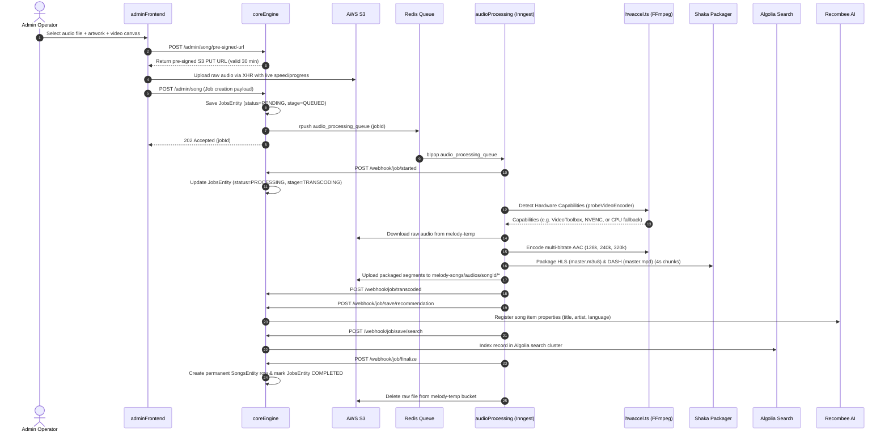
```mermaid
sequenceDiagram
    autonumber
    actor Admin as Admin Operator
    participant ADF as adminFrontend
    participant CE as coreEngine
    participant S3 as AWS S3
    participant RD as Redis Queue
    participant AP as audioProcessing (Inngest)
    participant HW as hwaccel.ts (FFmpeg)
    participant SP as Shaka Packager
    participant AL as Algolia Search
    participant RC as Recombee AI

    Admin->>ADF: Select audio file + artwork + video canvas
    ADF->>CE: POST /admin/song/pre-signed-url
    CE-->>ADF: Return pre-signed S3 PUT URL (valid 30 min)
    ADF->>S3: Upload raw audio via XHR with live speed/progress
    ADF->>CE: POST /admin/song (Job creation payload)
    CE->>CE: Save JobsEntity (status=PENDING, stage=QUEUED)
    CE->>RD: rpush audio_processing_queue (jobId)
    CE-->>ADF: 202 Accepted (jobId)

    RD->>AP: blpop audio_processing_queue
    AP->>CE: POST /webhook/job/started
    CE->>CE: Update JobsEntity (status=PROCESSING, stage=TRANSCODING)
    
    AP->>HW: Detect Hardware Capabilities (probeVideoEncoder)
    HW-->>AP: Capabilities (e.g. VideoToolbox, NVENC, or CPU fallback)
    AP->>S3: Download raw audio from melody-temp
    AP->>HW: Encode multi-bitrate AAC (128k, 240k, 320k)
    AP->>SP: Package HLS (master.m3u8) & DASH (master.mpd) (4s chunks)
    AP->>S3: Upload packaged segments to melody-songs/audios/songId/*
    AP->>CE: POST /webhook/job/transcoded
    
    AP->>CE: POST /webhook/job/save/recommendation
    CE->>RC: Register song item properties (title, artist, language)
    
    AP->>CE: POST /webhook/job/save/search
    CE->>AL: Index record in Algolia search cluster
    
    AP->>CE: POST /webhook/job/finalize
    CE->>CE: Create permanent SongsEntity row & mark JobsEntity COMPLETED
    AP->>S3: Delete raw file from melody-temp bucket
```

### Media Profile Specifications

#### Audio Profiles (Google Shaka Packager)
| Profile | Bitrate | Sample Rate | Channels | Bandwidth Declaration | Segment Length | Format |
| :--- | :---: | :---: | :---: | :---: | :---: | :---: |
| **Low** | `128 kbps` | 44,100 Hz | 2 (Stereo) | 128,000 bps | 4.0 seconds | AAC / fMP4 |
| **Medium** | `240 kbps` | 44,100 Hz | 2 (Stereo) | 240,000 bps | 4.0 seconds | AAC / fMP4 |
| **High** | `320 kbps` | 44,100 Hz | 2 (Stereo) | 320,000 bps | 4.0 seconds | AAC / fMP4 |

#### Video Profiles (Adaptive Music Videos & Canvas Backdrops)
| Profile | Resolution | Target Bitrate | Maxrate | Buffer Size | Bandwidth Declaration | Segment Length |
| :--- | :---: | :---: | :---: | :---: | :---: | :---: |
| **1080p** | $1920 \times 1080$ | `4500 kbps` | `5000 kbps` | `9000 kbps` | 4,800,000 bps | 4.0 seconds |
| **720p** | $1280 \times 720$ | `2500 kbps` | `3000 kbps` | `5000 kbps` | 2,700,000 bps | 4.0 seconds |
| **480p** | $854 \times 480$ | `1200 kbps` | `1500 kbps` | `2400 kbps` | 1,400,000 bps | 4.0 seconds |
| **360p** | $640 \times 360$ | `600 kbps` | `800 kbps` | `1200 kbps` | 750,000 bps | 4.0 seconds |

---

## 4. 5-Stage Zero-Orphan Cascade Deletion Teardown

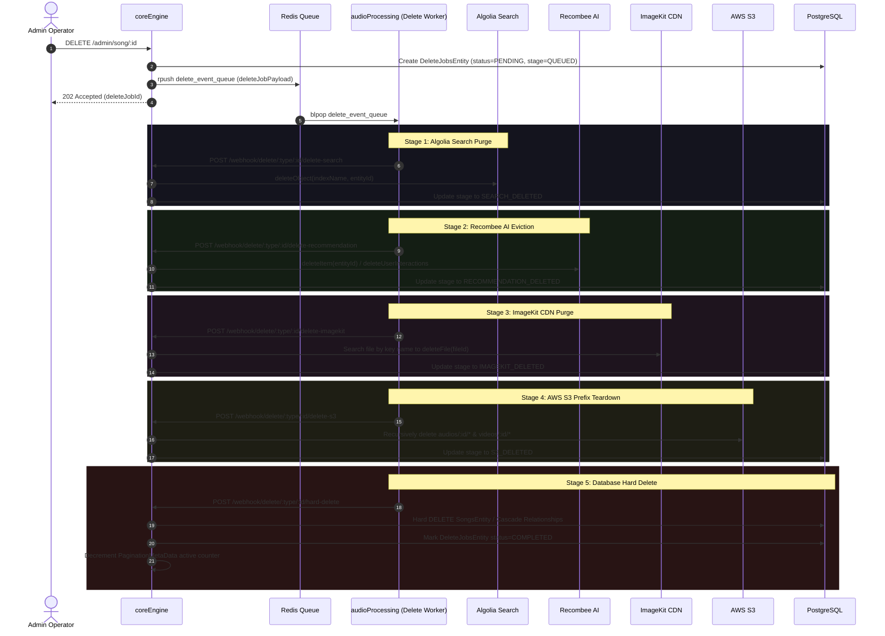
```mermaid
sequenceDiagram
    autonumber
    actor Admin as Admin Operator
    participant CE as coreEngine
    participant RD as Redis Queue
    participant AP as audioProcessing (Delete Worker)
    participant AL as Algolia Search
    participant RC as Recombee AI
    participant IK as ImageKit CDN
    participant S3 as AWS S3
    participant PG as PostgreSQL

    Admin->>CE: DELETE /admin/song/:id
    CE->>PG: Create DeleteJobsEntity (status=PENDING, stage=QUEUED)
    CE->>RD: rpush delete_event_queue (deleteJobPayload)
    CE-->>Admin: 202 Accepted (deleteJobId)

    RD->>AP: blpop delete_event_queue
    
    rect rgb(20, 20, 30)
        Note over AP,AL: Stage 1: Algolia Search Purge
        AP->>CE: POST /webhook/delete/:type/:id/delete-search
        CE->>AL: deleteObject(indexName, entityId)
        CE->>PG: Update stage to SEARCH_DELETED
    end

    rect rgb(20, 30, 20)
        Note over AP,RC: Stage 2: Recombee AI Eviction
        AP->>CE: POST /webhook/delete/:type/:id/delete-recommendation
        CE->>RC: deleteItem(entityId) / deleteUserInteractions
        CE->>PG: Update stage to RECOMMENDATION_DELETED
    end

    rect rgb(30, 20, 30)
        Note over AP,IK: Stage 3: ImageKit CDN Purge
        AP->>CE: POST /webhook/delete/:type/:id/delete-imagekit
        CE->>IK: Search file by key name to deleteFile(fileId)
        CE->>PG: Update stage to IMAGEKIT_DELETED
    end

    rect rgb(30, 30, 20)
        Note over AP,S3: Stage 4: AWS S3 Prefix Teardown
        AP->>CE: POST /webhook/delete/:type/:id/delete-s3
        CE->>S3: Recursively delete audios/:id/* & videos/:id/*
        CE->>PG: Update stage to S3_DELETED
    end

    rect rgb(40, 20, 20)
        Note over AP,PG: Stage 5: Database Hard Delete
        AP->>CE: POST /webhook/delete/:type/:id/hard-delete
        CE->>PG: Hard DELETE SongsEntity / Cascade Relationships
        CE->>PG: Mark DeleteJobsEntity status=COMPLETED
        CE->>CE: Decrement PaginationMetaData active counter
    end
```

---

## 5. Hi-Fi Web Audio API & DSP Sound Architecture

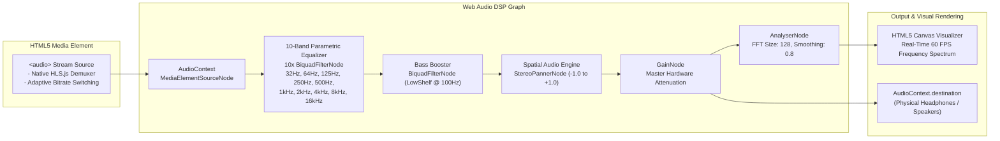
```mermaid
flowchart LR
    subgraph HME ["HTML5 Media Element"]
        A["&lt;audio&gt; Stream Source<br/>- Native HLS.js Demuxer<br/>- Adaptive Bitrate Switching"]
    end

    subgraph DSP ["Web Audio DSP Graph"]
        B["AudioContext<br/>MediaElementSourceNode"]
        C["10-Band Parametric Equalizer<br/>10x BiquadFilterNode<br/>32Hz, 64Hz, 125Hz, 250Hz, 500Hz,<br/>1kHz, 2kHz, 4kHz, 8kHz, 16kHz"]
        D["Bass Booster<br/>BiquadFilterNode (LowShelf @ 100Hz)"]
        E["Spatial Audio Engine<br/>StereoPannerNode (-1.0 to +1.0)"]
        F["GainNode<br/>Master Hardware Attenuation"]
        G["AnalyserNode<br/>FFT Size: 128, Smoothing: 0.8"]
    end

    subgraph OVR ["Output & Visual Rendering"]
        H["HTML5 Canvas Visualizer<br/>Real-Time 60 FPS Frequency Spectrum"]
        I["AudioContext.destination<br/>(Physical Headphones / Speakers)"]
    end

    A --> B
    B --> C
    C --> D
    D --> E
    E --> F
    F --> G
    G --> H
    F --> I
```

---

## 6. Real-Time Byte-Level Upload Tracking Engine

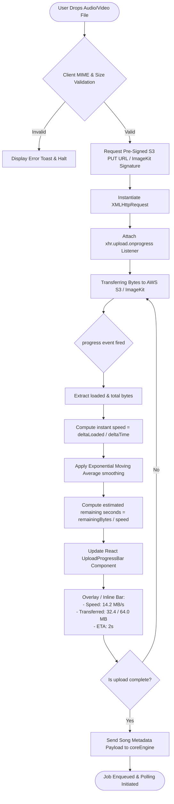
```mermaid
flowchart TD
    Start(["User Drops Audio/Video File"]) --> Validate{"Client MIME & Size Validation"}
    Validate -->|Invalid| ErrorToast["Display Error Toast & Halt"]
    Validate -->|Valid| RequestToken["Request Pre-Signed S3 PUT URL / ImageKit Signature"]
    
    RequestToken --> InitXHR["Instantiate XMLHttpRequest"]
    InitXHR --> SetupProgress["Attach xhr.upload.onprogress Listener"]
    
    SetupProgress --> TransferLoop["Transferring Bytes to AWS S3 / ImageKit"]
    
    TransferLoop --> ProgressEvent{"progress event fired"}
    ProgressEvent --> CalcBytes["Extract loaded & total bytes"]
    CalcBytes --> CalcSpeed["Compute instant speed = deltaLoaded / deltaTime"]
    CalcSpeed --> CalcEMA["Apply Exponential Moving Average smoothing"]
    CalcEMA --> CalcETA["Compute estimated remaining seconds = remainingBytes / speed"]
    CalcETA --> UpdateState["Update React UploadProgressBar Component"]
    UpdateState --> RenderUI["Overlay / Inline Bar:<br/>- Speed: 14.2 MB/s<br/>- Transferred: 32.4 / 64.0 MB<br/>- ETA: 2s"]
    
    RenderUI --> CheckDone{"Is upload complete?"}
    CheckDone -->|No| TransferLoop
    CheckDone -->|Yes| TriggerRegistration["Send Song Metadata Payload to coreEngine"]
    TriggerRegistration --> Complete(["Job Enqueued & Polling Initiated"])
```

---

## 7. Database Schema & Entity Relational Model (ERD)

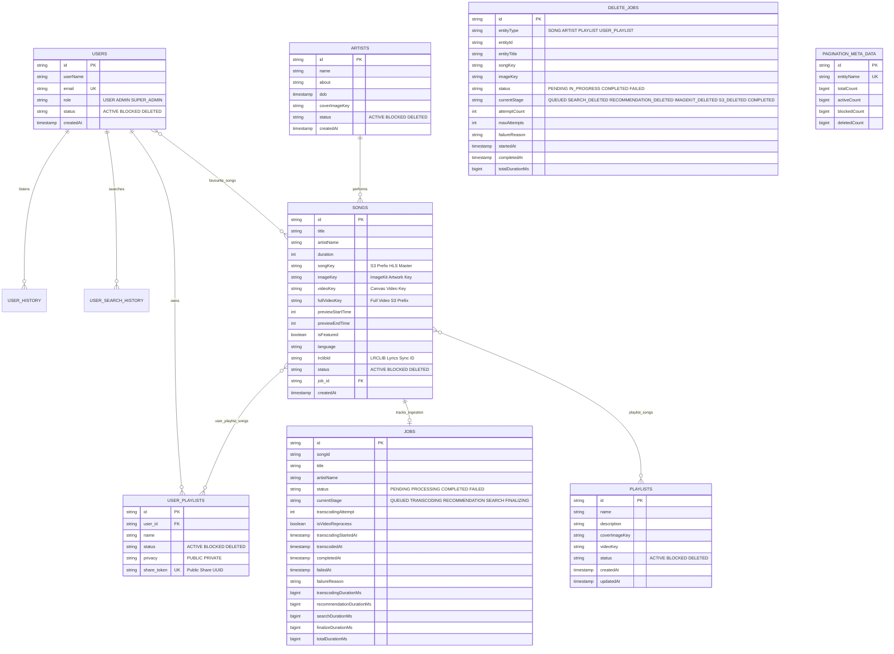
```mermaid
erDiagram
    USERS ||--o{ USER_PLAYLISTS : owns
    USERS ||--o{ USER_HISTORY : listens
    USERS ||--o{ USER_SEARCH_HISTORY : searches
    USERS }o--o{ SONGS : favourite_songs
    
    SONGS ||--o| JOBS : tracks_ingestion
    SONGS }o--o{ PLAYLISTS : playlist_songs
    SONGS }o--o{ USER_PLAYLISTS : user_playlist_songs
    
    ARTISTS ||--o{ SONGS : performs
    
    USERS {
        string id PK
        string userName
        string email UK
        string role "USER ADMIN SUPER_ADMIN"
        string status "ACTIVE BLOCKED DELETED"
        timestamp createdAt
    }

    SONGS {
        string id PK
        string title
        string artistName
        int duration
        string songKey "S3 Prefix HLS Master"
        string imageKey "ImageKit Artwork Key"
        string videoKey "Canvas Video Key"
        string fullVideoKey "Full Video S3 Prefix"
        int previewStartTime
        int previewEndTime
        boolean isFeatured
        string language
        string lrclibId "LRCLIB Lyrics Sync ID"
        string status "ACTIVE BLOCKED DELETED"
        string job_id FK
        timestamp createdAt
    }

    ARTISTS {
        string id PK
        string name
        string about
        timestamp dob
        string coverImageKey
        string status "ACTIVE BLOCKED DELETED"
        timestamp createdAt
    }

    PLAYLISTS {
        string id PK
        string name
        string description
        string coverImageKey
        string videoKey
        string status "ACTIVE BLOCKED DELETED"
        timestamp createdAt
        timestamp updatedAt
    }

    USER_PLAYLISTS {
        string id PK
        string user_id FK
        string name
        string status "ACTIVE BLOCKED DELETED"
        string privacy "PUBLIC PRIVATE"
        string share_token UK "Public Share UUID"
    }

    JOBS {
        string id PK
        string songId
        string title
        string artistName
        string status "PENDING PROCESSING COMPLETED FAILED"
        string currentStage "QUEUED TRANSCODING RECOMMENDATION SEARCH FINALIZING"
        int transcodingAttempt
        boolean isVideoReprocess
        timestamp transcodingStartedAt
        timestamp transcodedAt
        timestamp completedAt
        timestamp failedAt
        string failureReason
        bigint transcodingDurationMs
        bigint recommendationDurationMs
        bigint searchDurationMs
        bigint finalizeDurationMs
        bigint totalDurationMs
    }

    DELETE_JOBS {
        string id PK
        string entityType "SONG ARTIST PLAYLIST USER_PLAYLIST"
        string entityId
        string entityTitle
        string songKey
        string imageKey
        string status "PENDING IN_PROGRESS COMPLETED FAILED"
        string currentStage "QUEUED SEARCH_DELETED RECOMMENDATION_DELETED IMAGEKIT_DELETED S3_DELETED COMPLETED"
        int attemptCount
        int maxAttempts
        string failureReason
        timestamp startedAt
        timestamp completedAt
        bigint totalDurationMs
    }

    PAGINATION_META_DATA {
        string id PK
        string entityName UK
        bigint totalCount
        bigint activeCount
        bigint blockedCount
        bigint deletedCount
    }
```

---

## 8. Dual-Pipeline State Machines & Self-Healing Retries

### Ingestion Pipeline State Machine
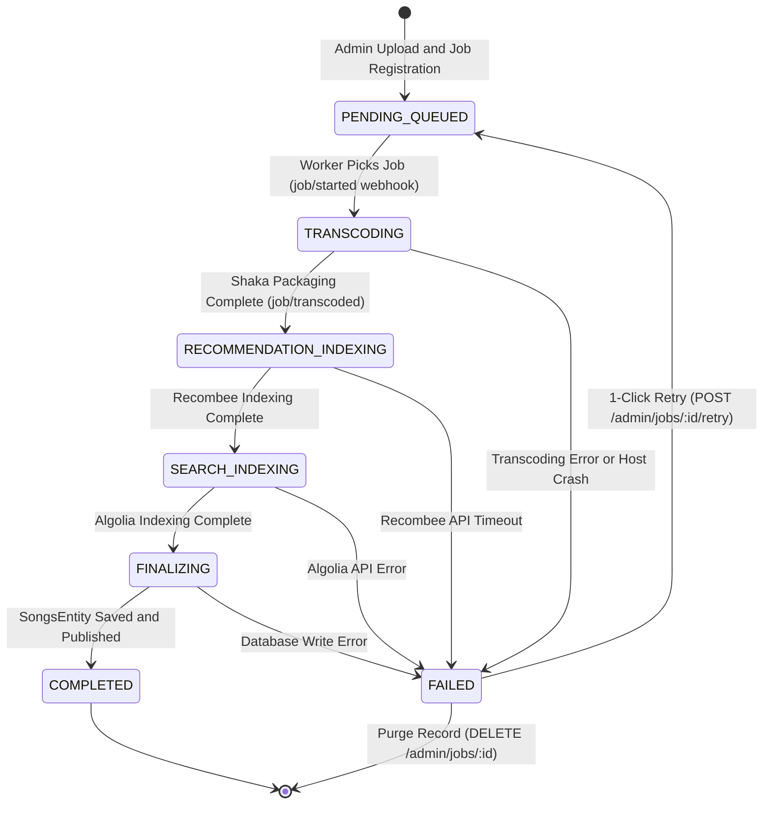
```mermaid
stateDiagram-v2
    [*] --> PENDING_QUEUED: Admin Upload and Job Registration
    PENDING_QUEUED --> TRANSCODING: Worker Picks Job (job/started webhook)
    TRANSCODING --> RECOMMENDATION_INDEXING: Shaka Packaging Complete (job/transcoded)
    RECOMMENDATION_INDEXING --> SEARCH_INDEXING: Recombee Indexing Complete
    SEARCH_INDEXING --> FINALIZING: Algolia Indexing Complete
    FINALIZING --> COMPLETED: SongsEntity Saved and Published
    
    TRANSCODING --> FAILED: Transcoding Error or Host Crash
    RECOMMENDATION_INDEXING --> FAILED: Recombee API Timeout
    SEARCH_INDEXING --> FAILED: Algolia API Error
    FINALIZING --> FAILED: Database Write Error
    
    FAILED --> PENDING_QUEUED: 1-Click Retry (POST /admin/jobs/:id/retry)
    FAILED --> [*]: Purge Record (DELETE /admin/jobs/:id)
    COMPLETED --> [*]
```

### Cascade Deletion State Machine
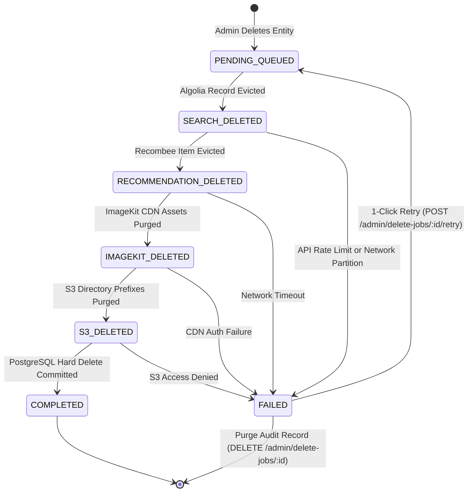
```mermaid
stateDiagram-v2
    [*] --> PENDING_QUEUED: Admin Deletes Entity
    PENDING_QUEUED --> SEARCH_DELETED: Algolia Record Evicted
    SEARCH_DELETED --> RECOMMENDATION_DELETED: Recombee Item Evicted
    RECOMMENDATION_DELETED --> IMAGEKIT_DELETED: ImageKit CDN Assets Purged
    IMAGEKIT_DELETED --> S3_DELETED: S3 Directory Prefixes Purged
    S3_DELETED --> COMPLETED: PostgreSQL Hard Delete Committed
    
    SEARCH_DELETED --> FAILED: API Rate Limit or Network Partition
    RECOMMENDATION_DELETED --> FAILED: Network Timeout
    IMAGEKIT_DELETED --> FAILED: CDN Auth Failure
    S3_DELETED --> FAILED: S3 Access Denied
    
    FAILED --> PENDING_QUEUED: 1-Click Retry (POST /admin/delete-jobs/:id/retry)
    FAILED --> [*]: Purge Audit Record (DELETE /admin/delete-jobs/:id)
    COMPLETED --> [*]
```

---

## 9. Recombee AI Interaction & Recommendation Scoring Model

The continuous personalization engine tracks real-time listening behavior, converting micro-interactions into weighted numerical feedback signals:

| User Action | Rating Value | Semantic Signal Strength | Algorithmic Intent |
| :--- | :---: | :---: | :--- |
| **Explicit Skip** | `-1.0` | **Strongest Negative** | Punish genre, artist, and acoustic features immediately. |
| **Removed from Favourites** | `-0.5` | **Strong Negative** | Decrease affinity score across user collaborative cluster. |
| **Removed from Custom Playlist** | `-0.4` | **Moderate Negative** | Demote item in future session queue generation. |
| **Drop-off (Listened $< 25\%$)** | `-0.3` | **Soft Negative** | Penalize song recommendation without penalizing artist. |
| **Partial Listen ($25\% - 50\%$)** | `+0.1` | **Weak Positive** | Indicates curiosity or passive listening. |
| **Engaged Listen ($50\% - 90\%$)** | `+0.3` | **Moderate Positive** | Positive affinity reinforcement. |
| **Completed Listen ($\ge 90\%$)** | `+0.7` | **Strong Positive** | Significant positive weight for collaborative filtering. |
| **Added to Custom Playlist** | `+0.8` | **Stronger Positive** | Strong intent signal to recommend similar tracks. |
| **Added to Favourites (Heart)** | `+1.0` | **Strongest Positive** | Anchor track for building immediate personalized radio. |

---

## 10. Dual-Layer Security & Authentication Architecture

One Melody implements distinct, zero-trust security regimes tailored for high-throughput public consumers versus high-privilege administrative operators:

### A. Consumer Authentication (`coreEngine` @ `api.one-org.me`)
Designed for passwordless simplicity and low-latency token verification:

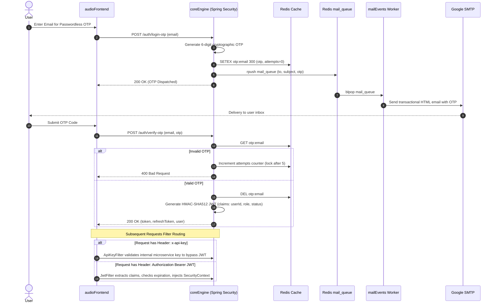
```mermaid
sequenceDiagram
    autonumber
    actor User
    participant AF as audioFrontend
    participant CE as coreEngine (Spring Security)
    participant RD as Redis Cache
    participant MQ as Redis mail_queue
    participant MW as mailEvents Worker
    participant SMTP as Google SMTP

    User->>AF: Enter Email for Passwordless OTP
    AF->>CE: POST /auth/login-otp (email)
    CE->>CE: Generate 6-digit cryptographic OTP
    CE->>RD: SETEX otp:email 300 (otp, attempts=0)
    CE->>MQ: rpush mail_queue (to, subject, otp)
    CE-->>AF: 200 OK (OTP Dispatched)

    MQ->>MW: blpop mail_queue
    MW->>SMTP: Send transactional HTML email with OTP
    SMTP-->>User: Delivery to user inbox
    
    User->>AF: Submit OTP Code
    AF->>CE: POST /auth/verify-otp (email, otp)
    CE->>RD: GET otp:email
    alt Invalid OTP
        CE->>RD: Increment attempts counter (lock after 5)
        CE-->>AF: 400 Bad Request
    else Valid OTP
        CE->>RD: DEL otp:email
        CE->>CE: Generate HMAC-SHA512 JWT (claims: userId, role, status)
        CE-->>AF: 200 OK (token, refreshToken, user)
    end

    Note over AF,CE: Subsequent Requests Filter Routing
    alt Request has Header: x-api-key
        AF->>CE: ApiKeyFilter validates internal microservice key to bypass JWT
    else Request has Header: Authorization Bearer JWT
        AF->>CE: JwtFilter extracts claims, checks expiration, injects SecurityContext
    end
```

---

### B. Administrative Fleet Authentication (`admin` @ `admin.one-org.me`)
Designed with stateful Redis session tracking, instant remote revocation, and HTTP-only cookie security:

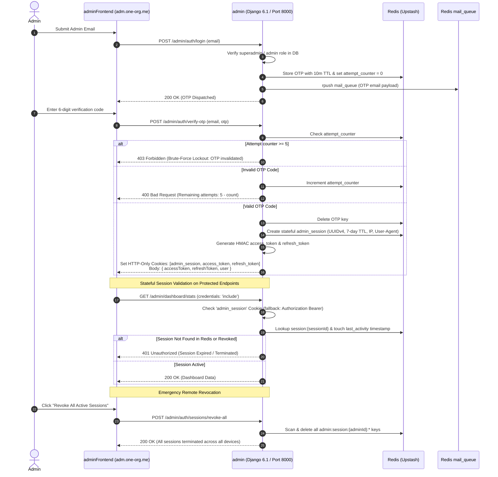
```mermaid
sequenceDiagram
    autonumber
    actor Admin
    participant ADF as adminFrontend (adm.one-org.me)
    participant ADM as admin (Django 6.1 / Port 8000)
    participant RD as Redis (Upstash)
    participant MQ as Redis mail_queue

    Admin->>ADF: Submit Admin Email
    ADF->>ADM: POST /admin/auth/login (email)
    ADM->>ADM: Verify superadmin / admin role in DB
    ADM->>RD: Store OTP with 10m TTL & set attempt_counter = 0
    ADM->>MQ: rpush mail_queue (OTP email payload)
    ADM-->>ADF: 200 OK (OTP Dispatched)

    Admin->>ADF: Enter 6-digit verification code
    ADF->>ADM: POST /admin/auth/verify-otp (email, otp)
    ADM->>RD: Check attempt_counter
    alt Attempt counter >= 5
        ADM-->>ADF: 403 Forbidden (Brute-Force Lockout: OTP invalidated)
    else Invalid OTP Code
        ADM->>RD: Increment attempt_counter
        ADM-->>ADF: 400 Bad Request (Remaining attempts: 5 - count)
    else Valid OTP Code
        ADM->>RD: Delete OTP key
        ADM->>RD: Create stateful admin_session (UUIDv4, 7-day TTL, IP, User-Agent)
        ADM->>ADM: Generate HMAC access_token & refresh_token
        ADM-->>ADF: Set HTTP-Only Cookies: [admin_session, access_token, refresh_token]<br/>Body: { accessToken, refreshToken, user }
    end

    Note over ADF,ADM: Stateful Session Validation on Protected Endpoints
    ADF->>ADM: GET /admin/dashboard/stats (credentials: 'include')
    ADM->>ADM: Check 'admin_session' Cookie (fallback: Authorization Bearer)
    ADM->>RD: Lookup session:{sessionId} & touch last_activity timestamp
    alt Session Not Found in Redis or Revoked
        ADM-->>ADF: 401 Unauthorized (Session Expired / Terminated)
    else Session Active
        ADM-->>ADF: 200 OK (Dashboard Data)
    end

    Note over ADF,ADM: Emergency Remote Revocation
    Admin->>ADF: Click "Revoke All Active Sessions"
    ADF->>ADM: POST /admin/auth/sessions/revoke-all
    ADM->>RD: Scan & delete all admin:session:{adminId}:* keys
    ADM-->>ADF: 200 OK (All sessions terminated across all devices)
```

---

## 11. Repository Catalog & File Tree

```
AudioMelodySpringboot/
├── coreEngine/                   # Spring Boot 3.4 / Java 21 High-Concurrency Audio & API Engine
│   ├── src/main/java/me/one_org/melody/
│   │   ├── AlgoliaSearch/        # Algolia indexing, search client, and multi-index reindexing
│   │   ├── Configuration/        # Spring Security, CORS, Redis & Actuator health configurations
│   │   ├── Controllers/          # REST endpoints (Authentication, Consumer Api, User Playlists)
│   │   ├── Dto/                  # Strongly-typed Data Transfer Objects & records
│   │   ├── Entity/               # JPA Hibernate PostgreSQL entity mappings
│   │   ├── Enums/                # User roles, playlist privacy, audio bitrates
│   │   ├── Exceptions/           # Global controller advice and custom HTTP exceptions
│   │   ├── Filters/              # JwtFilter stateless authentication filter chain
│   │   ├── Recommendation/       # Recombee AI client & real-time interaction listeners
│   │   ├── Repository/           # Spring Data JPA Repositories with custom criteria queries
│   │   └── Services/             # Consumer music, playback tracking, auth & user services
│   ├── src/main/resources/       # application.yaml (Hikari scale-to-zero tuned) & profiles
│   └── pom.xml                   # Maven dependencies and Java 21 compiler configuration
│
├── admin/                        # Python 3.12 / Django 6.1 Dedicated Administrative Microservice
│   ├── admin/                    # Django project core & WSGI / ASGI entrypoints
│   │   ├── admin/                # Settings, ASGI, WSGI, base routing
│   │   │   ├── settings.py       # CORS, Redis session store, DB pool & security configs
│   │   │   ├── urls.py           # Core URL gateway dispatching to API routes
│   │   │   └── wsgi.py           # Production Gunicorn entrypoint
│   │   ├── api/                  # Administrative REST & Webhook API application
│   │   │   ├── views.py          # 2,400+ LOC REST controllers (CRUD, Retries, Sessions, Dashboard)
│   │   │   ├── urls.py           # Route declarations for admin management and webhook events
│   │   │   ├── models.py         # Django ORM models matching database schemas
│   │   │   ├── serializers.py    # DRF serializers for request validation and response mapping
│   │   │   ├── authentication.py # Stateful Redis session authenticator & HTTP-only cookie handler
│   │   │   ├── middleware.py     # Request telemetry, session refresh, and security headers
│   │   │   ├── services.py       # S3 pre-signed URLs, ImageKit, Algolia, Recombee & Redis queue ops
│   │   │   └── helpers.py        # DTO conversion helpers, metric aggregators, audit tools
│   │   └── manage.py             # Django management CLI script
│   ├── Dockerfile                # High-performance 2-stage build (uv builder -> non-root runner)
│   ├── pyproject.toml            # Astral uv dependency manifest
│   └── uv.lock                   # Deterministic dependency lockfile
│
├── audioProcessing/              # Bun / Inngest Media Packaging Worker
│   ├── functions/                # Inngest step functions (fetchJob, transcode, delete)
│   ├── jobseeker/                # Redis queue polling workers (worker.ts, deleteWorker.ts)
│   ├── lib/transcode/            # FFmpeg hardware acceleration & Shaka Packager engine
│   │   ├── cleanup.ts            # Active path registry and stale temp cleaner
│   │   ├── hwaccel.ts            # Zero-stall hardware encoder detection engine
│   │   ├── index.ts              # Multi-bitrate audio transcoding & HLS/DASH packager
│   │   └── video.ts              # Video canvas and full music video stream packager
│   ├── index.ts                  # Express API server & Inngest endpoint dispatcher
│   └── package.json              # Bun runtime dependencies
│
├── audioFrontend/                # Next.js 16 Consumer Streaming Web Application (Vercel)
│   ├── src/app/                  # App Router pages (home, songs, artists, playlists)
│   ├── src/components/player/    # Web Audio API DSP player, equalizer, queue & visualizer
│   │   ├── hooks/                # Custom hooks (useAudioSync, useHlsPlayer, useWebAudio)
│   │   └── ...                   # Player controls, tooltips, and lyrics viewers
│   ├── src/lib/                  # API clients, player utils, and preview player
│   └── src/store/player/         # @tanstack/react-store reactive playback & queue store
│
├── adminFrontend/                # Next.js 16 Administrative Command Center (adm.one-org.me)
│   ├── src/app/                  # Management dashboards (songs, artists, playlists, jobs)
│   │   ├── jobs/page.tsx         # Dual-pipeline monitoring console with 1-click retries
│   │   └── ...                   # Media management & session telemetry views
│   ├── src/components/           # Byte-level upload progress bar & portalized modals
│   ├── src/lib/adminFetch.ts     # Credentials-included fetch wrapper for cross-subdomain sessions
│   └── src/lib/upload-utils.ts   # XHR byte-level upload speed and ETA streaming engine
│
├── workers/mailEvents/           # Asynchronous Transactional Email Worker
│   ├── NodeMailer/               # SMTP transporter and responsive HTML email templates
│   ├── Redis/                    # ioredis client configuration
│   └── index.ts                  # Redis FIFO consumer with rate-limit circuit breaker
│
├── migrations/                   # PostgreSQL Schema Migration Suite
│   ├── v2_schema_video_migration.sql
│   ├── v3_schema_full_video_migration.sql
│   ├── v4_schema_job_tracking_migration.sql
│   ├── v5_sync_jobs_with_songs.sql
│   ├── v6_create_delete_jobs_table.sql
│   ├── v7_add_genre_column.sql
│   └── index.ts                  # Bun migration runner script
│
├── Docker/                       # Containerization & Environment Configuration
│   ├── aws/                      # Production AWS deployment environment templates
│   ├── docker-compose.yml        # Multi-container local orchestration
│   ├── core.env.example          # Spring Boot environment dictionary
│   ├── admin.env.example         # Django admin environment dictionary
│   ├── frontend.env.example      # Next.js consumer environment dictionary
│   └── mail.env.example          # Mail worker environment dictionary
│
└── .github/workflows/            # Continuous Integration & Zero-Downtime Deployment
    └── work.yml                  # 4-service parallel build matrix + automated EC2 SSH rollouts
```

---

## 12. API Reference & Webhook Contracts

The One Melody ecosystem cleanly isolates public consumer audio streaming operations from administrative command endpoints and media packaging webhooks.

### 🎧 Consumer Audio & Identity APIs (`https://api.one-org.me`)
*Powered by Spring Boot 3.4 / Java 21 ([`coreEngine`](file:///Users/Karan/Desktop/Coding/AudioMelodySpringboot/coreEngine))*

#### Authentication & Session Lifecycle (`/auth/*`)
- `POST /auth/login-otp`: Requests a 6-digit cryptographic OTP dispatched asynchronously to user email.
- `POST /auth/verify-otp`: Verifies OTP and returns HMAC-SHA512 access and refresh tokens.
- `POST /auth/refresh-token`: Rotates access tokens without requiring re-authentication.
- `GET /auth/me`: Retrieves current authenticated user profile and subscription details.
- `POST /auth/logout`: Invalidates client session.

#### Music Catalogue & Adaptive Streaming (`/api/*`)
- `GET /api/songs`: Filterable, paginated track catalog (`page`, `size`, `status`, `language`).
- `GET /api/songs/{id}`: Detailed track metadata including HLS master playlist URL (`.m3u8`), canvas video URL, and bitrate manifests.
- `GET /api/songs/{id}/similar`: Fetches AI recommendations based on acoustic similarity vectors.
- `GET /api/artists`: Paginated artist catalogue with artwork URLs and follower counts.
- `GET /api/artists/{id}`: Artist biography and social profiles.
- `GET /api/artists/{id}/songs`: Full verified discography for a given artist.
- `GET /api/playlists`: Public curated playlists.
- `GET /api/user/playlists`: User-owned custom playlists.
- `POST /api/user/playlists`: Creates a user playlist with custom privacy settings.
- `GET /api/user/playlists/shared/{shareToken}`: Public unauthenticated shared playlist access.
- `POST /api/interaction/track-play`: Tracks listening completion percentage for Recombee AI training.
- `POST /api/interaction/favourite/{songId}`: Adds song to user favourites.
- `DELETE /api/interaction/favourite/{songId}`: Removes song from user favourites.
- `GET /api/search`: Instant search across tracks, artists, and albums.

---

### 🛡️ Administrative Fleet & Management APIs (`https://admin.one-org.me`)
*Powered by Python 3.12 / Django 6.1 / Gunicorn ([`admin`](file:///Users/Karan/Desktop/Coding/AudioMelodySpringboot/admin))*

#### Health & Diagnostic Probe
- `GET /health`: Liveness and readiness health probe returning `{ "status": "ok" }`.

#### Stateful Session Authentication (`/admin/auth/*`)
- `POST /admin/auth/login`: Validates admin credentials; dispatches 6-digit OTP via Redis `mail_queue`.
- `POST /admin/auth/verify-otp`: Verifies OTP with **5-attempt brute-force lockout** protection. Issues `admin_session` HTTP-only cookie and JWT tokens.
- `POST /admin/auth/resend-otp`: Dispatches a fresh OTP code subject to active cooldown timers.
- `POST /admin/auth/refresh-token`: Rotates access tokens via HTTP-only cookie validation.
- `GET /admin/auth/me`: Returns current administrator role, permissions, and active session details.
- `POST /admin/auth/logout`: Invalidates session key from Redis and clears browser cookies.
- `GET /admin/auth/sessions`: Lists all active administrative sessions across devices with IP and User-Agent telemetry.
- `POST /admin/auth/sessions/{sessionId}`: Revokes an individual active device session.
- `POST /admin/auth/sessions/revoke-all`: **Fleet Revocation** — immediately terminates all active sessions across all devices for the administrator.

#### Administrative Dashboard & Deep Search
- `GET /admin/dashboard/stats`: Aggregates real-time metrics (total songs, active ingestion jobs, artists, storage utilization, and system health).
- `GET /admin/search`: Administrative deep search across draft, processing, and published media records.

#### Media & Catalogue Management (`/admin/song`, `/admin/artist`, `/admin/playlist`, `/admin/account`)
- `GET /admin/song`: Filterable, paginated track catalog (`status`, `genre`, `language`, `featured`).
- `POST /admin/song`: Initializes audio track and registers background ingestion job.
- `GET /admin/song/{id}`: Detailed track record with transcoding telemetry and stage timestamps.
- `PUT /admin/song/{id}`: Updates track metadata, album artwork, or canvas video.
- `DELETE /admin/song/{id}`: Initiates 5-stage atomic cascade deletion teardown.
- `POST /admin/song/{id}/featured`: Toggles featured showcase status on home feed.
- `POST /admin/song/{id}/reprocess-audio`: Re-dispatches track for multi-bitrate audio transcoding.
- `POST /admin/song/{id}/reprocess-video`: Initiates background repackaging of video canvases.
- `POST /admin/song/{id}/recover-media`: Restores S3 media references for orphan tracks.
- `POST /admin/song/reindex-recombee`: Batch re-indexes entire song library into Recombee AI engine.
- `GET /admin/artist` & `POST /admin/artist`: Artist list and creation with ImageKit CDN media.
- `GET /admin/artist/{id}` & `PUT /admin/artist/{id}`: Artist metadata and discography management.
- `GET /admin/playlist` & `POST /admin/playlist`: Curated playlist management.
- `POST /admin/playlist/{id}/songs/add`: Batch appends songs to curated playlist.
- `DELETE /admin/playlist/{id}/songs/{songId}`: Removes track from playlist.
- `GET /admin/account`: Admin operator and user management console.
- `POST /admin/account/{email}/block`: Blocks user from streaming or login.
- `POST /admin/account/{email}/unblock`: Restores user account access.
- `POST /admin/account/{email}/demote`: Revokes administrative privileges.
- `DELETE /admin/account/{email}`: Cascades complete user profile deletion.

#### Dual Ingestion & Teardown Monitoring Console (`/admin/jobs` & `/admin/delete-jobs`)
- `GET /admin/jobs/summary`: Ingestion metrics (processing, queued, completed, failed, stage durations).
- `GET /admin/jobs/queues`: Live Redis queue depths (`audio_processing_queue`, `delete_event_queue`, `mail_queue`).
- `GET /admin/jobs/active`: Real-time active ingestion jobs with elapsed stage timers.
- `GET /admin/jobs`: Filterable, paginated audit list of ingestion jobs (`status`, `stage`, `search`).
- `GET /admin/jobs/status/{status}`: Paginated ingestion jobs filtered by enum (`PENDING`, `PROCESSING`, `COMPLETED`, `FAILED`).
- `GET /admin/jobs/pending`, `/processing`, `/failed`, `/completed`: Paginated status helpers.
- `POST /admin/jobs/{jobId}/retry`: **1-Click Retry** with atomic state wipe and Redis re-enqueue.
- `POST /admin/jobs/{jobId}/recover-media`: Recovers broken media pointers.
- `DELETE /admin/jobs/failed`: Cleans all failed ingestion job records.
- `DELETE /admin/jobs/{jobId}`: Deletes individual job audit record.
- `POST /admin/jobs/sync-metadata`: Synchronizes job metadata with published song records.
- `GET /admin/delete-jobs/summary`: High-level metrics for cascade teardown jobs.
- `GET /admin/delete-jobs/active`: Paginated active cascade teardown jobs.
- `GET /admin/delete-jobs`: Filterable, paginated audit list of cascade delete jobs.
- `GET /admin/delete-jobs/status/{status}`: Paginated cascade jobs filtered by enum.
- `GET /admin/delete-jobs/pending`, `/in-progress`, `/failed`, `/completed`: Paginated status helpers.
- `POST /admin/delete-jobs/{jobId}/retry`: **1-Click Retry** for failed cascade deletion jobs.
- `DELETE /admin/delete-jobs/{jobId}`: Deletes cascade teardown audit record.

---

### ⚡ Signed Worker Webhook Protocol (`/webhook`)
*Managed by the [`admin`](file:///Users/Karan/Desktop/Coding/AudioMelodySpringboot/admin) microservice*

#### Pre-Signed Media Generation (`/webhook/internal/*`)
- `POST /webhook/internal/song-upload-url`: Generates S3 SigV4 pre-signed PUT URLs with content-type locks.
- `POST /webhook/internal/video-upload-url`: Generates S3 pre-signed URLs for background canvas video uploads.
- `GET /webhook/internal/image-upload-param`: Generates ImageKit client-side auth signature, token, and expire timestamp.
- `GET /webhook/internal/video-upload-param`: Generates ImageKit upload authentication token for video canvases.

#### Media Ingestion Lifecycle Webhooks (`/webhook/job/*`)
- `POST /webhook/job/{jobId}/transcoding-started`: Worker signals start of FFmpeg multi-bitrate transcoding.
- `POST /webhook/job/{jobId}/transcoded`: Worker signals Shaka Packager HLS/DASH chunking completed.
- `POST /webhook/job/{jobId}/save-recommendation`: Worker signals Recombee AI vector properties saved.
- `POST /webhook/job/{jobId}/save-search`: Worker signals Algolia InstantSearch index updated.
- `POST /webhook/job/{jobId}/finalize`: Finalizes job, calculates duration, and marks song `PUBLISHED`.
- `POST /webhook/job/{jobId}/failed`: Reports failure stack, stage, and triggers telemetry alert.

#### Atomic Cascade Teardown Webhooks (`/webhook/delete/*`)
- `POST /webhook/delete/{entityType}/{entityId}/delete-search`: Step 1 — Purges record from Algolia.
- `POST /webhook/delete/{entityType}/{entityId}/delete-recommendation`: Step 2 — Purges record from Recombee.
- `POST /webhook/delete/{entityType}/{entityId}/delete-imagekit`: Step 3 — Deletes artwork/canvas from ImageKit CDN.
- `POST /webhook/delete/{entityType}/{entityId}/delete-s3`: Step 4 — Purges master playlist & chunks from AWS S3.
- `POST /webhook/delete/{entityType}/{entityId}/hard-delete`: Step 5 — Hard deletes entity row from PostgreSQL.
- `POST /webhook/delete/{entityType}/{entityId}/failed`: Reports cascade failure and trips circuit breaker.

---

## 13. Installation, Local Development & Docker Runbook

### Prerequisites
- **Java Development Kit (JDK)**: Version 21 or higher
- **Maven**: Version 3.9+
- **Python**: Version 3.12+
- **Astral uv**: Fast Python package and environment manager (`curl -LsSf https://astral.sh/uv/install.sh | sh`)
- **Bun**: Version 1.3+ (or Node.js 20+)
- **FFmpeg**: Version 6.0+ compiled with `libx264` and `libaac`
- **Google Shaka Packager**: Version 3.0+ executable in system `PATH`
- **Docker & Docker Compose**: For local container orchestration
- **Caddy**: Version 2.x (or containerized Caddy)
- **PostgreSQL**: Neon Serverless or Local 15+
- **Redis**: Upstash Redis or Local 7+

---

### Step 1: Clone Repository & Configure Environment Variables
```bash
git clone https://github.com/karankumar786786/AudioMelodySpringboot.git
cd AudioMelodySpringboot
```

Create environment configuration files for each service:
```bash
cp coreEngine/.env.example coreEngine/.env
cp admin/.env.example admin/.env
cp audioProcessing/.env.example audioProcessing/.env
cp workers/mailEvents/.env.example workers/mailEvents/.env
cp audioFrontend/.env.example audioFrontend/.env.local
cp adminFrontend/.env.example adminFrontend/.env.local
```

Key environment configurations:
- **Database**: Neon PostgreSQL connection string (`DB_URL`, `DB_USER`, `DB_PASSWORD`).
- **Redis**: Upstash Redis host, port, password, and queue identifiers (`REDIS_HOST`, `REDIS_PASSWORD`, etc.).
- **Cloud Providers**: AWS S3 credentials (`AWS_ACCESS_KEY_ID`, `AWS_SECRET_ACCESS_KEY`, `AWS_BUCKET_NAME`), ImageKit keys, Algolia App ID & Admin Key, and Recombee Database ID & Secret.
- **Cross-Origin**: `CORS_ALLOWED_ORIGINS=https://adm.one-org.me,http://localhost:3000,http://localhost:3001`.

---

### Step 2: Database Setup & Schema Migrations
If running databases locally:
```bash
docker run -d --name melody-postgres -p 5432:5432 -e POSTGRES_DB=melody -e POSTGRES_USER=postgres -e POSTGRES_PASSWORD=postgres postgres:15
docker run -d --name melody-redis -p 6379:6379 redis:7-alpine
```

Execute schema migrations:
```bash
cd migrations
bun install
bun run index.ts
cd ..
```

---

### Step 3: Launch Microservices Locally

#### 1. Start Core Engine (`coreEngine`)
```bash
cd coreEngine
mvn clean compile
mvn spring-boot:run
```
*Access API on: `http://localhost:9090`*

#### 2. Start Administrative Command Microservice (`admin`)
```bash
cd admin
uv sync
uv run python admin/manage.py runserver 8000
```
*Access Admin API on: `http://localhost:8000` (Health: `http://localhost:8000/health`)*

#### 3. Start Media Packaging Worker (`audioProcessing`)
```bash
cd audioProcessing
bun install
bun run index.ts
```
*In a separate terminal, launch the Inngest dev server:*
```bash
bun run inngest
```
*Inngest dashboard available at: `http://localhost:8288`*

#### 4. Start Transactional Mail Worker (`workers/mailEvents`)
```bash
cd workers/mailEvents
bun install
bun run index.ts
```

#### 5. Start Consumer Frontend (`audioFrontend`)
```bash
cd audioFrontend
bun install
bun run dev
```
*Streaming app available at: `http://localhost:3000`*

#### 6. Start Administration Console (`adminFrontend`)
```bash
cd adminFrontend
bun install
bun run dev --port 3001
```
*Admin console available at: `http://localhost:3001`*

---

### Step 4: AWS EC2 Production Orchestration & Caddy Reverse Proxy

In production, all backend services run containerized on an AWS EC2 instance (`13.126.178.32`) behind a **Caddy 2** reverse proxy that automatically provisions and renews TLS certificates via Let's Encrypt:

#### Production `docker-compose.yml` (`/home/ubuntu/audioMelody/docker-compose.yml`)
```yaml
services:
  core:
    image: karankumar9955/core:latest
    container_name: core
    pull_policy: always
    restart: unless-stopped
    env_file:
      - core.env
    expose:
      - "9090"
    networks:
      - app

  admin:
    image: karankumar9955/admin:latest
    container_name: admin
    pull_policy: always
    restart: unless-stopped
    env_file:
      - admin.env
    expose:
      - "8000"
    networks:
      - app

  mail:
    image: karankumar9955/mail:latest
    container_name: mail
    pull_policy: always
    restart: unless-stopped
    env_file:
      - mail.env
    networks:
      - app

  caddy:
    image: caddy:2
    container_name: caddy
    restart: unless-stopped
    ports:
      - "80:80"
      - "443:443"
    volumes:
      - ./Caddyfile:/etc/caddy/Caddyfile:ro
      - caddy_data:/data
      - caddy_config:/config
    networks:
      - app

networks:
  app:

volumes:
  caddy_data:
  caddy_config:
```

#### Production `Caddyfile` (`/home/ubuntu/audioMelody/Caddyfile`)
```caddyfile
api.one-org.me {
    reverse_proxy core:9090
}

admin.one-org.me {
    reverse_proxy admin:8000
}
```

#### Zero-Downtime Caddy Configuration Reload
```bash
docker compose exec caddy caddy reload --config /etc/caddy/Caddyfile
```

---

### Step 5: Automated CI/CD Pipeline (`.github/workflows/work.yml`)

The repository leverages a fully automated continuous integration and continuous deployment pipeline powered by GitHub Actions:

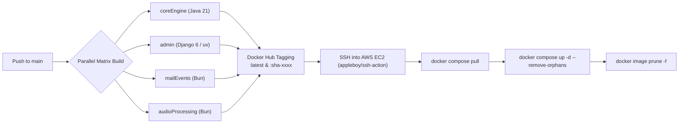
```mermaid
flowchart LR
    Push["Push to main"] --> Matrix{"Parallel Matrix Build"}
    Matrix --> CoreBuild["coreEngine (Java 21)"]
    Matrix --> AdminBuild["admin (Django 6 / uv)"]
    Matrix --> MailBuild["mailEvents (Bun)"]
    Matrix --> MediaBuild["audioProcessing (Bun)"]
    
    CoreBuild --> Hub["Docker Hub Tagging<br/>:latest & :sha-xxxx"]
    AdminBuild --> Hub
    MailBuild --> Hub
    MediaBuild --> Hub
    
    Hub --> SSH["SSH into AWS EC2 (appleboy/ssh-action)"]
    SSH --> Pull["docker compose pull"]
    Pull --> Up["docker compose up -d --remove-orphans"]
    Up --> Prune["docker image prune -f"]
```

1. **Parallel Multi-Service Matrix Build**: Concurrent builds compile and test each microservice independently.
2. **Docker Layer Caching (`type=gha`)**: GitHub Actions caching speeds up image builds from minutes to seconds.
3. **Automated Zero-Downtime EC2 Rolling Deploy**: Upon successful image push, the workflow SSHs into the production EC2 host, pulls new images, rolling restarts containers, and purges stale layers.
4. **Vercel Edge Frontends**: `audioFrontend` and `adminFrontend` (`adm.one-org.me`) deploy automatically on commit to their production domains.

---

## 📜 License & Copyright

Copyright © 2026 One Melody Ecosystem. Developed and maintained by Karan Kumar. All rights reserved.
Licensed under the [MIT License](file:///Users/Karan/Desktop/Coding/AudioMelodySpringboot/LICENSE).
