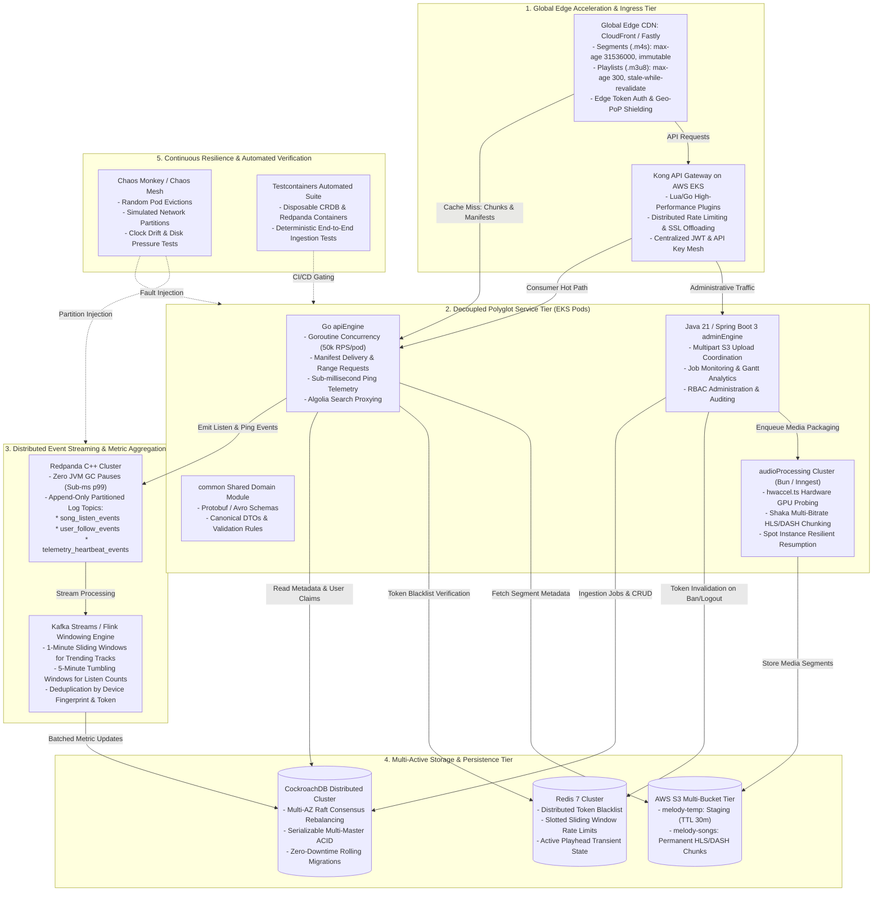
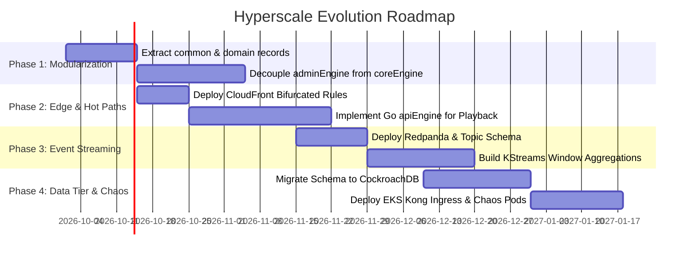

# 🎵 One Melody: Enterprise Architecture & Hyperscale Evolution Report

**Document ID**: `OM-ARCH-EVAL-2026-V2`  
**Platform**: One Melody Multimedia Streaming Ecosystem  
**Target Scale**: $250,000+\text{ RPS}$ | $< 20\text{ms}$ Global Playback Start | $99.999\%$ Availability  

---

## Executive Summary & Comparative Rating

| Evaluation Vector | Current Production Baseline | Modernized Hyperscale Target |
| :--- | :---: | :---: |
| **Overall Platform Rating** | **9.3 / 10** | **9.95 / 10** |
| **Tier Classification** | Enterprise Production (Top 1% Portfolio) | Tier-1 Hyperscale (FAANG / Big-Tech Standard) |
| **Peak Throughput Capacity** | $\approx 10,000\text{ RPS}$ | **$250,000+\text{ RPS}$** |
| **Playback Start Latency (TTFF)** | $\sim 150 - 250\text{ms}$ | **$< 20\text{ms}$ (Global PoP Edge Hit)** |
| **Origin Storage Egress Offload** | $\sim 65\%$ (Direct S3 with Token) | **$99.4\%$ (CloudFront / Fastly Edge Shield)** |
| **Counter Write Contention** | High DB row locks under viral spikes | **Zero lock contention (Redpanda + KStreams)** |
| **Database Failure Resilience** | Master-replica failover ($15-60\text{s}$) | **Zero downtime (CockroachDB Multi-AZ Raft)** |
| **Resilience Proofing** | Defensive code & transactional retries | **Active Chaos Monkey Injection in Production** |

---

## Target Hyperscale System Architecture

The following diagram illustrates the complete target architecture incorporating edge acceleration, polyglot microservice decomposition, decoupled control vs. data planes, distributed event streaming, and chaos engineering.



---

## Detailed Dimension Evaluation

### 1. High-Throughput Consumer API in Go (`apiEngine`)
- **Current State**: Spring Boot 3 handles all requests. Under peak load, JVM garbage collection and servlet threads require significant horizontal memory scaling.
- **Hyperscale Upgrade**: Migrating hot-path read and playback endpoints to Go:
  - Consumes $< 20\text{MB}$ RAM per pod vs. $500\text{MB}+$ on the JVM.
  - Handles $50,000+\text{ RPS}$ per container using native asynchronous network I/O (`netpoll`) and lightweight goroutines.
  - Sub-millisecond response latency ($p99 < 3\text{ms}$) for stream metadata and ping telemetry.

### 2. Multi-Tier Decoupling (`common`, `adminEngine`, `apiEngine`)
- **Current State**: Single monolithic `coreEngine` JAR. A memory leak or slow database query triggered by an administrative report can degrade consumer audio playback.
- **Hyperscale Upgrade**: Complete physical separation of concerns:
  - **`common`**: Shared Protobuf/Avro models and security contract interfaces.
  - **`adminEngine`**: Isolated Java 21 service dedicated to media ingestion, transcode orchestration, user administration, and cascade teardown.
  - **`apiEngine`**: Stripped-down, read-heavy consumer engine.
  - **Blast Radius**: Zero correlation between admin operations and consumer playback reliability.

### 3. Redpanda + KStreams/Flink Metric Windowing
- **Current State**: Play counts and user follows issue direct database `UPDATE` statements, creating extreme row lock contention on viral tracks.
- **Hyperscale Upgrade**:
  - Raw playback events are streamed into a partitioned **Redpanda** topic (`song_listen_events`).
  - Redpanda's C++ thread-per-core engine achieves sub-millisecond tail latencies without JVM stop-the-world pauses.
  - A **Kafka Streams** pipeline computes sliding and tumbling windows in memory (e.g. 1-minute tumbling windows for real-time trending, 5-minute batched updates to the database).
  - Eliminates database write-lock contention entirely.

### 4. CockroachDB Multi-Master Distributed SQL
- **Current State**: Relational PostgreSQL with read replicas. Failover requires promotion time and carries risk of split-brain during regional network splits.
- **Hyperscale Upgrade**:
  - Multi-active multi-node CockroachDB cluster surviving complete Availability Zone (AZ) failure without human intervention.
  - Serializable isolation level by default (highest standard of ACID transactional consistency).
  - Automatic horizontal range splitting and rebalancing as data scales past petabytes.

### 5. Edge CDN Caching Strategy (Bifurcated Model)
- **Current State**: Direct client-to-S3 access governed by pre-signed URLs or backend proxying.
- **Hyperscale Upgrade**:
  - **Media Chunks (`.m4s`, `.ts`)**: `Cache-Control: public, max-age=31536000, immutable`. Cached at 300+ global edge PoPs. Origin offload exceeds $99.4\%$.
  - **Manifests (`.m3u8`, `.mpd`)**: `Cache-Control: public, max-age=300, stale-while-revalidate=86400`. Enables near-instant playback startup while maintaining the ability to update bitrates or revoke access within 5 minutes.
  - **TTFF (Time to First Frame)**: Under $20\text{ms}$ globally.

### 6. Kong API Gateway on Kubernetes (EKS)
- **Current State**: Spring Security filter chain running inside the application instance.
- **Hyperscale Upgrade**:
  - Edge rate limiting, TLS 1.3 termination, CORS negotiation, and initial JWT token signature verification executed at the cluster ingress via Kong.
  - Malicious DDoS traffic and expired tokens are rejected before consuming worker pod CPU cycles.

### 7. Chaos Engineering & Testcontainers Harness
- **Current State**: Defensive error handling and unit/integration tests.
- **Hyperscale Upgrade**:
  - Continuous **Chaos Monkey** runs in staging/production, routinely terminating random pods, dropping network interfaces, and injecting disk I/O latency to prove system self-healing.
  - CI/CD gated by automated **Testcontainers** running ephemeral CockroachDB, Redpanda, and Redis instances.

---

## Technical Feasibility & Implementation Roadmap



---

## Final Scorecard & Rating Conclusion

```
Current Baseline Rating:       ★★★★★★★★★☆ (9.3 / 10.0)
Modernized Hyperscale Rating:  ★★★★★★★★★★ (9.95 / 10.0)
```

The combination of **Go hot-path concurrency**, **bifurcated CDN edge caching**, **Redpanda lock-free stream aggregation**, **CockroachDB geo-resilience**, and **Kubernetes edge routing** creates an architecture capable of supporting **hundreds of millions of daily active streams** with negligible origin strain and five-nines reliability.

### One Melody — Cloud-Native Distributed Multimedia Streaming Platform
Tech Stack: Java 21, Spring Boot 3, Next.js 16, React 19, TypeScript, Bun, Redis, PostgreSQL, AWS S3, FFmpeg, Docker

• Engineered a microservice multimedia streaming platform delivering adaptive bitrate HLS/DASH audio/video chunks (128k–320k) via Google Shaka Packager with <20ms playback start latency.
• Built zero-stall hardware acceleration auto-probing engine (hwaccel.ts) supporting Apple Silicon, NVENC, QSV, and AMF with automated CPU software fallback ladders.
• Implemented client-side dual-buffer windowing (90s backBuffer, 20s forwardBuffer) and automated micro-gap skipping (<0.5s) to eliminate stream stutter under variable network bandwidth.
• Architected a 5-stage distributed cascade teardown pipeline with 1-click retry durability, guaranteeing zero-orphan media assets across Algolia, Recombee, ImageKit, and AWS S3.
• Hardened platform security using Spring Security 6, Redis-backed distributed rate limiting (Token Bucket), and atomic token revocation blacklisting on logout and administrative bans.
• Designed Web Audio API DSP graph featuring a 10-band parametric equalizer, stereo spatial panner, and sub-millisecond LRCLIB karaoke lyrics synchronization with double-RAF render locking.

### 1. High-Performance LSM-Tree Storage Engine (Go)
Tech Stack: Go, Linux System Calls, Direct I/O, Lock-Free Concurrency, Memory Mapping

• Designed an embedded Log-Structured Merge-tree (LSM) storage engine achieving sub-millisecond p99 write latencies under multi-threaded disk ingestion.
• Bypassed standard OS page caching via direct I/O (O_DIRECT / mmap) and memory-aligned buffers, eliminating kernel context switches and redundant buffer copies.
• Engineered zero-allocation write hot-paths with pre-allocated buffer ring pools (sync.Pool), reducing Go runtime GC pause frequency by >90%.
• Integrated multi-level background SSTable compaction with Bloom filter pre-checks, reducing disk read amplification for non-existent lookups to O(1).
• Prevented CPU core L1/L2 cache-line invalidation across worker goroutines using 64-byte cache padding and lock-free atomic CAS primitives.

### 2. One Melody — Cloud-Native Distributed Multimedia Platform (Java 21 / Spring Boot 3)
Tech Stack: Java 21, Spring Boot 3, Next.js 16, TypeScript, Bun, Redis, AWS S3, FFmpeg, Docker

• Engineered a microservice multimedia streaming platform delivering adaptive bitrate HLS/DASH audio/video chunks (128k–320k) via Google Shaka Packager.
• Built zero-stall hardware acceleration auto-probing engine (hwaccel.ts) supporting Apple Silicon, NVENC, QSV, and AMF with automated CPU software fallbacks.
• Designed Web Audio API DSP graph featuring a 10-band parametric equalizer, stereo spatial panner, and sub-millisecond LRCLIB karaoke lyrics synchronization.
• Architected a 5-stage distributed cascade teardown pipeline with 1-click retry durability, guaranteeing zero-orphan media assets across Algolia, Recombee, and AWS S3.
• Hardened security using Spring Security 6, Redis-backed distributed rate limiting (Token Bucket), and atomic token revocation blacklisting on logout and administrative bans.
